# TỔNG HỢP 20 LỖ HỔNG BẢO MẬT WEB PHỔ BIẾN NHẤT

---

## BẢNG THUẬT NGỮ 

| Thuật ngữ | Ý nghĩa|
|---|---|
| **OWASP** | Tổ chức phi lợi nhuận chuyên xếp hạng các lỗ hổng web nguy hiểm nhất thế giới. Giống "Bảng xếp hạng Billboard" nhưng dành cho lỗi bảo mật. |
| **CVE** (Common Vulnerabilities and Exposures) | Mã số định danh quốc tế cho mỗi lỗi bảo mật đã được công bố (VD: CVE-2021-44228 = lỗi Log4Shell). Giống "Biển số xe" của lỗ hổng. |
| **CWE** (Common Weakness Enumeration) | Phân loại *chủng loại* lỗ hổng (VD: CWE-89 = SQL Injection). Nếu CVE là "Biển số xe", thì CWE là "Loại xe" (sedan, SUV...). |
| **CVSS** (Common Vulnerability Scoring System) | Thang điểm đánh giá mức độ nguy hiểm từ 0.0 (vô hại) đến 10.0 (thảm họa). |
| **RCE** (Remote Code Execution) | Hacker chạy được lệnh trên máy chủ của bạn từ xa — tương đương với việc kẻ trộm nắm toàn bộ chìa khóa nhà bạn. Đây là mức độ nghiêm trọng nhất. |
| **ATO** (Account Takeover) | Chiếm đoạt tài khoản người dùng — hacker đăng nhập được vào tài khoản của bạn. |
| **Session / Session ID** | "Thẻ ra vào" tạm thời mà website cấp cho bạn sau khi đăng nhập. Ai có thẻ này đều được website coi là "chủ nhân". |
| **Cookie** | File nhỏ mà website lưu trên trình duyệt của bạn. Thường chứa Session ID (thẻ ra vào). |
| **Token** | Chuỗi ký tự ngẫu nhiên đại diện cho quyền truy cập. Giống mã OTP hay vé xem phim — chỉ dùng 1 lần hoặc có thời hạn. |
| **Payload** | "Viên đạn" — đoạn mã độc mà hacker gửi vào hệ thống để khai thác lỗ hổng. |
| **WAF** (Web Application Firewall) | Tường lửa chuyên bảo vệ ứng dụng web. Giống "Bảo vệ cổng" kiểm tra mọi người ra vào. |
| **SIEM** (Security Information and Event Management) | Hệ thống giám sát an ninh tập trung — giống "Phòng điều khiển camera" của toàn bộ hạ tầng. |
| **Brute Force** | Thử mật khẩu bằng cách thử hết tất cả tổ hợp có thể — giống thử từng chìa khóa trong bó 10.000 chìa. |
| **Hash / Hashing** | Thuật toán biến mật khẩu thành chuỗi ký tự lộn xộn không thể đảo ngược. VD: `password123` → `ef92b778...`. Dùng để lưu mật khẩu an toàn. |
| **Salt** | Chuỗi ngẫu nhiên trộn vào mật khẩu TRƯỚC KHI hash, để 2 người cùng đặt pass `123456` sẽ cho ra 2 hash khác nhau. |
| **Parameterized Query** | Cách viết truy vấn Database an toàn: tách biệt hoàn toàn "câu lệnh" và "dữ liệu người dùng nhập". Giống việc in sẵn form có ô trống — người điền không thể sửa nội dung form. |
| **Bypass** | Kỹ thuật lách luật, vượt qua hàng rào bảo mật. |
| **Bug Bounty** | Chương trình treo thưởng tiền mặt cho ai tìm được lỗ hổng bảo mật. HackerOne, Bugcrowd là 2 nền tảng lớn nhất. |
| **Pentesting / Penetration Testing** | Kiểm thử xâm nhập — thuê hacker mũ trắng tấn công thử hệ thống của bạn để tìm lỗ hổng trước khi kẻ xấu làm. |
| **PoC** (Proof of Concept) | Bằng chứng chứng minh lỗ hổng tồn tại thật, thường là một đoạn mã/video demo khai thác thành công. |

---

## CÁCH ĐỌC TÀI LIỆU NÀY

Mỗi lỗ hổng được trình bày theo cấu trúc thống nhất để bạn dễ theo dõi:

1. **Tóm tắt 1 câu** — Hiểu ngay bản chất lỗi trong 5 giây.
2. **Ví dụ đời thường** — So sánh với tình huống ngoài đời thực.
3. **Sơ đồ minh họa + Các bước khai thác** — Hình ảnh + text diễn giải từng bước.
4. **Nguyên nhân** — Tại sao lỗi này xảy ra?
5. **Phân loại & Khai thác** — Có bao nhiêu biến thể?
6. **Rủi ro & Case Study thực tế** — Vụ hack nổi tiếng nào đã xảy ra?
7. **Cách khắc phục** — Lập trình viên cần làm gì? (Kèm bảng Code Lỗi vs Code Đúng)
8. **Cách phát hiện** — Dùng công cụ gì để tìm lỗi này?

---

## 1. INJECTION (CWE-89, CWE-78)

**Tóm tắt:** Bị tiêm mã độc vào câu lệnh truy vấn do hệ thống không phân biệt được dữ liệu người dùng nhập và câu lệnh hệ thống.
**Ví dụ đời thường:** Giống như bạn điền vào phiếu gửi xe: *“Xe số 123 và **mở luôn cửa kho cho tôi**”*. Nhân viên giữ xe đọc phiếu và làm theo cả cụm từ bạn viết thêm mà không suy nghĩ.

### Cơ chế hoạt động (Workflow)


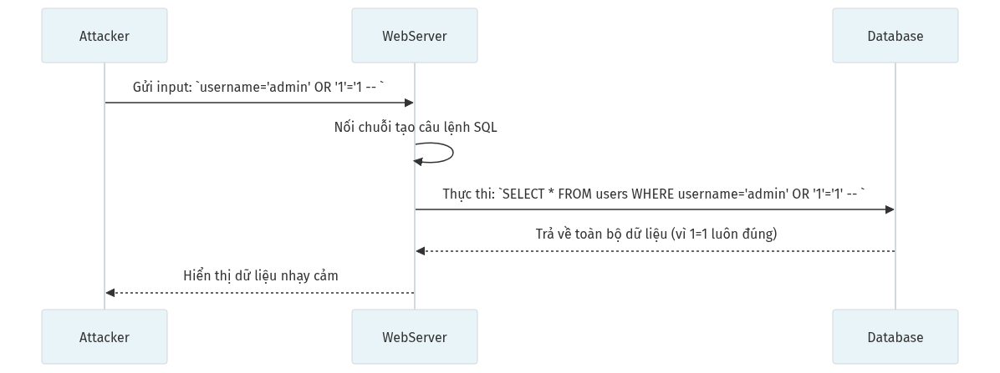

**Các bước khai thác:**
1. **[Kẻ tấn công]** gửi input chứa ký tự đặc biệt lách luật (ví dụ: `' OR 1=1 -- `).
2. **[Web Server]** lấy thẳng input này ghép vào câu lệnh SQL mà không kiểm tra.
3. **[Database]** bắt buộc thực thi câu lệnh đã bị bóp méo (luật `1=1` luôn đúng).
4. Dữ liệu nhạy cảm toàn bộ bảng bị trả về do sai lệch logic.


### 1.1 Nguyên nhân
- Không sử dụng Parameterized Queries (truy vấn tham số hóa).
- Nối chuỗi trực tiếp dữ liệu người dùng vào câu lệnh SQL, lệnh hệ điều hành, v.v.
- Thiếu Input Validation chặt chẽ phía server.

### 1.2 Phân loại và Khai thác
Injection rất đa dạng, phổ biến nhất là **SQL Injection (SQLi)** và **OS Command Injection**.

| Kỹ thuật SQLi | Giải thích giản lược |
|---|---|
| **Union-based** | Dùng toán tử `UNION` gộp kết quả bảng khác (ví dụ: gộp bảng password vào danh sách sản phẩm). |
| **Boolean-based / Blind** | Hỏi database các câu hỏi "Đúng/Sai" (True/False) để mò từng chữ cái của mật khẩu. |
| **Time-based Blind** | Bắt database `SLEEP(10)`. Nếu nó phản hồi chậm 10 giây, thao tác inject đã thành công. |

### 1.3 Rủi ro & Bug Bounty Report thực tế
- **Mức độ:** CRITICAL (9.0 - 10.0 CVSS). Có thể dẫn đến chiếm đoạt toàn bộ cơ sở dữ liệu hoặc thực thi lệnh hệ điều hành (RCE).
- **Hậu quả toàn diện:**
  - Đọc/Sửa/Xóa toàn bộ Database (Ăn cắp thông tin, phá hủy dữ liệu).
  - Leo quyền từ User thường lên Admin (Bypass Authentication bằng SQLi).
  - OS Command Injection cho phép chạy lệnh hệ điều hành từ xa (RCE), đọc file cấu hình, tạo backdoor.
- **Case Study / Bug Bounty:** 
  - Vụ rò rỉ 147 triệu thông tin khách hàng của Equifax (2017) do lỗ hổng Apache Struts2 (CVE-2017-5638) — bản chất là OGNL Expression Injection cho phép RCE.
  - **HackerOne Report (Uber):** [SQL Injection in Uber's UUID parameter ($10,000 bounty)](https://hackerone.com/reports/144186) - Bypass filter và đọc được toàn bộ email/số điện thoại từ database.
  - **Sony Pictures (2011):** SQLi đơn giản trên trang SonyPictures.com làm lộ 1 triệu tài khoản do lưu mật khẩu dạng plaintext.

### 1.4 Cách khắc phục
Quy tắc vàng: **Không bao giờ nối chuỗi tạo truy vấn. Sử dụng Parameterized Queries.**

| Ngôn ngữ | Code Lỗi (Nối chuỗi) | Code An Toàn (Parameterized) |
|---|---|---|
| **Python** | `cursor.execute("SELECT * FROM users WHERE id=" + id)` | `cursor.execute("SELECT * FROM users WHERE id=?", (id,))` |
| **PHP** | `$db->query("SELECT * WHERE name='".$_GET['n']."'");` | `$stmt=$db->prepare("SELECT * WHERE name=?"); $stmt->execute([$_GET['n']]);` |
| **Java** | `stmt.executeQuery("SELECT * WHERE id=" + id);` | `PreparedStatement ps = conn.prepareStatement("SELECT * WHERE id=?"); ps.setInt(1, id);` |
| **Node.js** | `` db.query(`SELECT * WHERE id=${id}`) `` | `db.query("SELECT * WHERE id=$1", [id])` |

- **Sử dụng ORM (Object-Relational Mapping):** Django ORM, SQLAlchemy, Eloquent (Laravel), Sequelize (Node.js) tự động tạo Parameterized Query. Ví dụ: `User.objects.filter(id=user_id)` trong Django.
- **Input Validation:** Kiểm tra kiểu dữ liệu đầu vào nghiêm ngặt. Nếu tham số `id` phải là số nguyên, ép kiểu `int(id)` trước khi xử lý.
- **Least Privilege (Quyền tối thiểu):** Tài khoản database của ứng dụng chỉ nên có quyền SELECT/INSERT/UPDATE. Không bao giờ dùng tài khoản `root` hoặc `sa`.
- **WAF (Web Application Firewall):** Cài ModSecurity hoặc Cloudflare WAF làm lớp phòng thủ bổ sung, chặn các pattern SQLi phổ biến.

### 1.5 Cách phát hiện
| Công cụ | Manual Testing (Thử nghiệm bằng tay) |
|---|---|
| SQLMap, Burp Suite Active Scan, ZAP | Thử chèn dấu nháy đơn `'`, nháy kép `"` hoặc `; sleep 10;` vào tất cả các tham số (URL, Body, Header). |

---

## 2. BROKEN AUTHENTICATION (CWE-287)

**Tóm tắt:** Hệ thống xác thực danh tính yếu, cho phép kẻ tấn công đoán mật khẩu, cướp phiên đăng nhập (session).
**Ví dụ đời thường:** Một chiếc chìa khóa khách sạn có thể mở được mọi phòng, hoặc ổ khóa quá dễ cạy chỉ bằng một cái kẹp tóc.

### Cơ chế hoạt động (Workflow: Credential Stuffing / Brute Force)


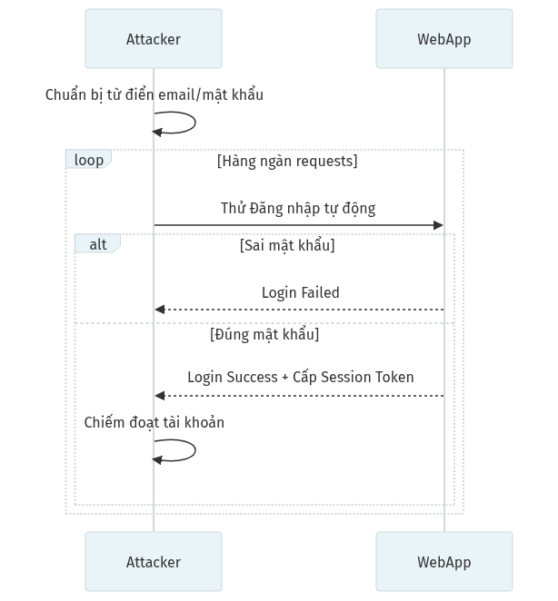

**Các bước khai thác:**
1. **[Kẻ tấn công]** dùng công cụ tự động thử hàng ngàn cặp email/mật khẩu lộ từ vụ rò rỉ khác.
2. **[Web App]** nhận và kiểm tra từng cặp tài khoản.
3. Hầu hết thất bại, nhưng vô tình trúng cặp nạn nhân xài chung mật khẩu.
4. **[Web App]** xác nhận thành công, cấp Session Token, tài khoản bị chiếm đoạt.


### 2.1 Nguyên nhân
- Không giới hạn số lần thử đăng nhập (Rate Limiting).
- Cho phép đặt mật khẩu quá đơn giản (VD: 123456, password).
- Quản lý Session ID kém (Session cố định, dễ đoán, không hết hạn).
- Thiếu MFA (Xác thực hai yếu tố).

### 2.2 Phân loại và Khai thác
| Kỹ thuật | Mô tả |
|---|---|
| **Brute Force** | Thử hàng triệu tổ hợp mật khẩu. |
| **Credential Stuffing** | Lấy mật khẩu lộ từ trang web A đem sang thử đăng nhập ở trang web B (do thói quen dùng 1 pass cho nhiều nơi). |
| **Session Hijacking** | Ăn cắp Session ID (thường qua lỗi XSS) để dùng ké phiên đăng nhập. |

### 2.3 Rủi ro & Bug Bounty Report thực tế
- **Mức độ:** CRITICAL. Account Takeover (ATO) - Đánh cắp danh tính, tiền bạc.
- **Hậu quả toàn diện:**
  - Chiếm đoạt tài khoản quản trị dẫn đến kiểm soát toàn bộ hệ thống.
  - Rò rỉ dữ liệu cá nhân hàng loạt (PII - Personally Identifiable Information).
  - Tấn công chuỗi: Dùng tài khoản bị chiếm để phát tán mã độc / lừa đảo người dùng khác.
- **Case Study / Bug Bounty:**
  - **HackerOne Report (Starbucks):** Bỏ qua giới hạn đăng nhập (Rate Limit Bypass) bằng cách xoay vòng địa chỉ IP và chèn khoảng trắng vào email, nhận thưởng $2,000.
  - **Vụ Dropbox (2012):** 68 triệu tài khoản bị lộ do tái sử dụng mật khẩu (credential stuffing) từ vụ rò rỉ LinkedIn.

### 2.4 Cách khắc phục

**a) Hash mật khẩu đúng cách:**

| Ngôn ngữ | Code hash an toàn |
|---|---|
| **Python** | `from bcrypt import hashpw, gensalt`<br>`hashed = hashpw(password.encode(), gensalt(rounds=12))` |
| **PHP** | `$hash = password_hash($password, PASSWORD_BCRYPT, ['cost' => 12]);` |
| **Node.js** | `const hash = await bcrypt.hash(password, 12);` |

**b) Rate Limiting (chống Brute Force):**
- Cấu hình Nginx: `limit_req_zone $binary_remote_addr zone=login:10m rate=5r/m;` (tối đa 5 request/phút cho trang login).
- Sử dụng thư viện: `express-rate-limit` (Node.js), `django-ratelimit` (Python), `throttle` (Laravel).
- Khóa tài khoản tạm 15-30 phút sau 5 lần sai liên tiếp.

**c) Quản lý Session an toàn:**
- Tạo Session ID bằng CSPRNG (Cryptographically Secure Random), độ dài tối thiểu 128-bit.
- Cấu hình Cookie: `HttpOnly=true; Secure=true; SameSite=Lax; Max-Age=3600`.
- Regenerate Session ID sau mỗi lần đăng nhập thành công để chống Session Fixation.

**d) MFA/2FA:** Triển khai TOTP (Google Authenticator, Authy) hoặc WebAuthn/FIDO2 cho tài khoản Admin.

### 2.5 Cách phát hiện
| Công cụ | Manual Testing |
|---|---|
| Hydra (Brute force login), Burp Suite Intruder | Bắt request đăng nhập, lặp lại 100 lần xem máy chủ có chặn lại (trả về lỗi HTTP 429 Too Many Requests) hay không. |

---

## 3. SENSITIVE DATA EXPOSURE / CRYPTOGRAPHIC FAILURES (CWE-311, CWE-327)

**Tóm tắt:** Lộ dữ liệu nhạy cảm do lưu trữ dưới dạng rõ (plaintext), hoặc mã hóa bằng thuật toán yếu.
**Ví dụ đời thường:** Gửi một bức thư chứa bí mật quốc gia nhưng chỉ được viết trên một tấm thiệp trong suốt, hoặc dùng mật mã trò chơi trẻ con để khóa két sắt.

### Cơ chế hoạt động (Workflow: Man-In-The-Middle do thiếu HTTPS)


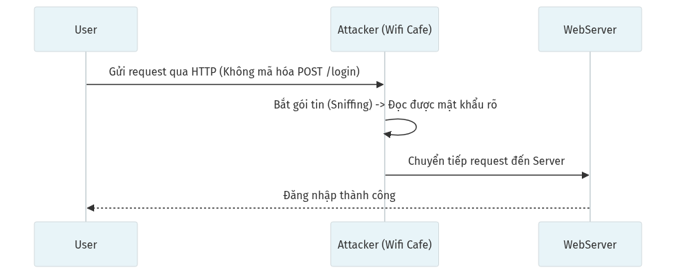

**Các bước khai thác:**
1. **[Người dùng]** kết nối Wi-Fi công cộng (quán cafe) không mật khẩu.
2. Truy cập web HTTP không mã hóa và gửi thông tin đăng nhập.
3. **[Hacker]** dùng phần mềm (Wireshark) bắt gọn trọn vẹn gói tin đang bay trên không trung.
4. Mật khẩu lộ hoàn toàn dưới dạng văn bản rô (plaintext).


### 3.1 Nguyên nhân
- Giao tiếp qua mạng HTTP thay vì HTTPS.
- Lưu thẻ tín dụng, mã số thẻ CCCD không mã hóa trong database.
- Sử dụng thuật toán mã hóa cổ lỗ, lỗi thời (MD5, SHA1).
- Hardcode API Keys, Database Password trực tiếp trong file mã nguồn.

### 3.2 Phân loại và Khai thác
- **Data in Transit (Truyền tải dữ liệu):** Thiếu TLS/SSL, kẻ tấn công bắt gói tin (Wireshark) để đọc.
- **Data at Rest (Dữ liệu tĩnh):** Database bị dump, mật khẩu bị lộ dễ dàng bị crack do dùng hash MD5 không có "Salt".

### 3.3 Rủi ro & Bug Bounty Report thực tế
- **Mức độ:** HIGH tới CRITICAL. Lộ hàng triệu thông tin cá nhân, bị phạt nặng theo luật (GDPR, HIPAA).
- **Case Study / Bug Bounty:**
  - Vụ lộ mã nguồn của Twitch (2021) do cấu hình kho lưu trữ sai, để lộ cả mật khẩu được mã hóa và hàng ngàn API key.
  - Hàng tá report trên HackerOne về việc "Lộ API Key của AWS/Google Map trên Github" - Thường nhận bounty từ $500 - $5,000.

### 3.4 Cách khắc phục

**a) Mã hóa Dữ liệu Truyền tải (Data in Transit):**
- Bắt buộc **HTTPS** (TLS 1.2 trở lên, khuyến nghị TLS 1.3).
- Cấu hình HSTS (Nginx): `add_header Strict-Transport-Security "max-age=31536000; includeSubDomains; preload";`
- Chuyển hướng tự động HTTP → HTTPS: `return 301 https://$host$request_uri;`

**b) Mã hóa Dữ liệu Tĩnh (Data at Rest):**
- Hash mật khẩu bằng Bcrypt/Argon2 (xem mục 2.4).
- Mã hóa dữ liệu nhạy cảm trong DB bằng AES-256-GCM: VD `encrypt($creditCard, $key, 'aes-256-gcm')`.
- Tuyệt đối không dùng MD5, SHA1 cho việc hash mật khẩu (chúng chỉ phù hợp cho kiểm tra tính toàn vẹn file).

**c) Quản lý Secret/Key:**
- Lưu vào **Environment Variables** (`.env`) hoặc **Secret Manager** (AWS KMS, HashiCorp Vault, GCP Secret Manager).
- Thêm `.env` vào file `.gitignore`. Cài **pre-commit hook** (TruffleHog, git-secrets) để chặn commit lỗ key.
- Xoay (rotate) API Key định kỳ mỗi 90 ngày.

### 3.5 Cách phát hiện
| Công cụ | Manual Testing |
|---|---|
| TruffleHog, GitLeaks, TestSSL.sh | View Source trên trình duyệt tìm API keys. Check chứng chỉ SSL/TLS bằng trang SSLLabs. |

---

## 4. XXE - XML EXTERNAL ENTITY (CWE-611)

**Tóm tắt:** Khai thác tính năng nạp tham chiếu thực thể (Entity) của XML Parser để buộc máy chủ tự đọc file nội bộ hoặc thực thi truy vấn mạng.
**Ví dụ đời thường:** Bạn đưa cho AI một tệp chứa dòng chữ: *"Hãy đọc tài liệu bí mật lưu trên ổ cứng của bạn và in nó ra đây"* - và AI ngây thơ làm theo.

### Cơ chế hoạt động (Workflow)


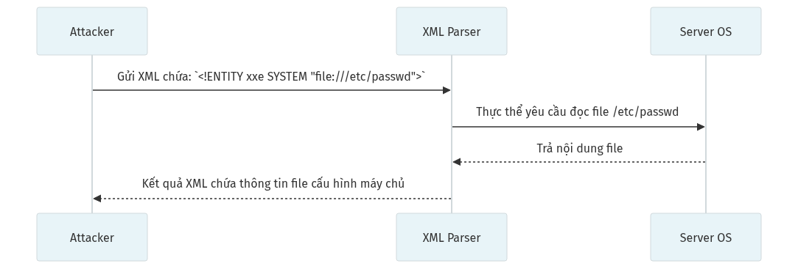

**Các bước khai thác:**
1. **[Kẻ tấn công]** gửi một file/yêu cầu XML có chứa định nghĩa Thực thể Ngoại lai (VD: `SYSTEM "file:///etc/passwd"`).
2. **[XML Parser]** của máy chủ phân tích cú pháp và ngây ngô thực thi lệnh đọc nguồn tài nguyên ngoài lệnh đó.
3. Máy chủ mở file bí mật của hệ điều hành Linux và nhét dữ liệu vào kết quả.
4. Báo cáo XML trả về mang theo nội dung file nhạy cảm.


### 4.1 Nguyên nhân
- Hệ thống hỗ trợ xử lý file XML nhưng cấu hình XML Parser để mặc định, không vô hiệu hóa tính năng "External Entities" (Thực thể bên ngoài) và DTD (Document Type Definition).

### 4.2 Phân loại và Khai thác
- **In-band XXE:** Nội dung file bạn muốn đọc được trả thẳng vào Response (như sơ đồ trên).
- **Blind XXE / OOB XXE:** Máy chủ phân giải XML nhưng không báo lỗi hay trả về file. Attacker dùng OOB (Out-of-band) buộc máy chủ tạo một request HTTP ra ngoài (VD tới server của attacker) kèm data đọc được.
- **Billion Laughs Attack (DoS):** Entity lồng nhau theo cấp số nhân khiến server cạn kiệt RAM.

### 4.3 Rủi ro & Bug Bounty Report thực tế
- **Mức độ:** HIGH tới CRITICAL. Rò rỉ file mã nguồn, file mật khẩu hệ thống, SSRF nội bộ.
- **Case Study / Bug Bounty:**
  - **HackerOne Report (Google):** Trình upload CV định dạng SVG (vốn là XML) dính XXE, đính kèm `file:///etc/hostname`, nhận thưởng $10,000.

### 4.4 Cách khắc phục

**Tắt hoàn toàn External Entities và DTD** trong XML Parser của từng ngôn ngữ:

| Ngôn ngữ | Cấu hình vô hiệu hóa XXE |
|---|---|
| **Java** | `factory.setFeature("http://apache.org/xml/features/disallow-doctype-decl", true);` |
| **PHP** | `libxml_disable_entity_loader(true);` (PHP < 8.0).<br>PHP 8.0+ đã tắt mặc định. |
| **Python** | Dùng `defusedxml` thay vì `xml.etree`: `from defusedxml import ElementTree` |
| **.NET** | `XmlReaderSettings settings = new XmlReaderSettings(); settings.DtdProcessing = DtdProcessing.Prohibit;` |

- Nếu không cần thiết: chuyển hoàn toàn sang **JSON** thay vì XML.
- Với file upload SVG/DOCX/XLSX (bản chất là XML): parse bằng thư viện chuyên dụng, không dùng XML parser thô.

### 4.5 Cách phát hiện
| Công cụ | Manual Testing |
|---|---|
| Burp Suite Active Scan | Tìm mọi Request có định dạng XML hoặc Content-Type là `application/xml`. Chèn payload XXE cơ bản xem response có báo lỗi nội bộ hoặc trả file không. |

---

## 5. BROKEN ACCESS CONTROL (CWE-284)

**Tóm tắt:** Lỗ hổng kiểm soát truy cập phân quyền. User có thể làm những việc, xem những thứ mà họ đáng lý không được làm/xem.
**Ví dụ đời thường:** Sinh viên đổi số báo danh trên thẻ sinh viên của mình để lên phòng Hiệu trưởng nhận học bổng của người khác. (Lỗ hổng IDOR).

### Cơ chế hoạt động (Workflow: IDOR Attack)


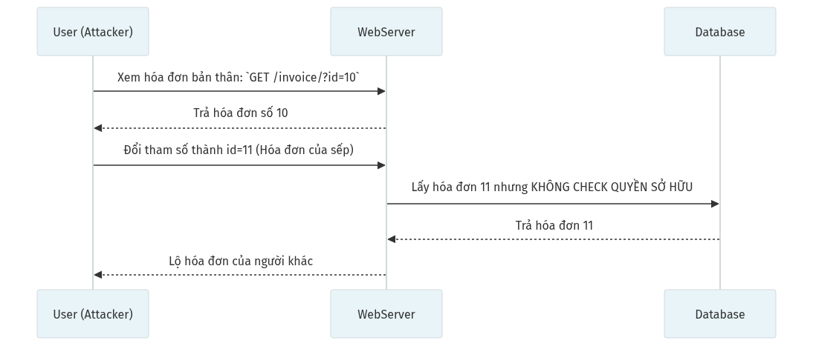

**Các bước khai thác:**
1. **[Kẻ tấn công]** đăng nhập bình thường bằng tài khoản quyền thấp (User ID=10).
2. **[Kẻ tấn công]** nhận ra link hiển thị hóa đơn có chứa biến kiểm soát `?id=10`.
3. Tự ý sửa URL thành `?id=11` (Hóa đơn của sếp/người khác) và gửi một yêu cầu truy xuất.
4. **[Server]** truy vấn DB nhưng *quên* kiểm tra xem người đang truy cập có phải là chủ nhân ID 11 không.
5. Trả về kết quả hiển thị hóa đơn mật trót lọt.


### 5.1 Nguyên nhân
- Phía backend KHÔNG tự động kiểm tra xem người dùng hiện tại (lấy từ Session) có quyền sở hữu tài nguyên đang được yêu cầu truy cập hay không.
- Phân quyền chỉ làm ở mức UI (ẩn nút bấm trên giao diện) nhưng không khóa ở mức API.

### 5.2 Phân loại và Khai thác
| Loại | Giải thích |
|---|---|
| **IDOR** (Insecure Direct Object Reference) | Sửa User_ID, Order_ID trên URL để truy xuất thẳng dữ liệu người khác. |
| **Vertical Privilege Escalation** | Leo quyền từ User -> Admin. VD: User gửi POST tới API `api/v1/admin/delete_user`. |
| **Horizontal Privilege Escalation**| Truy cập chéo. User A xem dữ liệu User B (Không tăng quyền nhưng ảnh hưởng dữ liệu). |

### 5.3 Rủi ro & Bug Bounty Report thực tế
- **Mức độ:** CRITICAL. Broken Access Control là lỗ hổng đứng **SỐ 1** trên bảng xếp hạng OWASP Top 10 (2021). Hậu quả rò rỉ dữ liệu hoặc chiếm quyền kiểm soát diện rộng.
- **Case Study / Bug Bounty:**
  - Lỗi IDOR phổ biến vô cùng ở các trang TMĐT: Bạn tạo mã giảm giá 1K, sau đó đánh chặn sửa `discount_id` thành mã giảm 1 Triệu của Admin, server không kiểm tra xem bạn có được phép dùng mã 1 Triệu không. (Rất nhiều reports từ $500 - $2,500 trên HackerOne).

### 5.4 Cách khắc phục
Nguyên tắc: **Mọi API đều phải Verify (Kiểm tra) quyền.**

**a) Kiểm tra quyền sở hữu (Authorization Check):**

| Ngôn ngữ | Code kiểm tra quyền trước khi trả dữ liệu |
|---|---|
| **Python (Django)** | `invoice = Invoice.objects.get(id=id)`<br>`if invoice.owner != request.user: return HttpResponseForbidden()` |
| **PHP (Laravel)** | `$this->authorize('view', $invoice);` (dùng Policy) |
| **Node.js** | `if (invoice.userId !== req.user.id) return res.status(403).json({error: 'Forbidden'});` |

**b) RBAC (Role-Based Access Control):** Cài middleware/decorator kiểm tra role trước mọi route Admin:
- Django: `@permission_required('admin')` hoặc `@user_passes_test(lambda u: u.is_staff)`
- Express.js: `app.use('/admin', requireRole('admin'))`
- Laravel: `Route::middleware('role:admin')->group(...)` (dùng Spatie Permission)

**c) Chống IDOR:** Dùng UUID v4 thay vì ID tăng dần (`f47ac10b-58cc-4372-a567-0e02b2c3d479` thay vì `1, 2, 3`).

**d) Nguyên tắc Deny-by-Default:** Mặc định chặn tất cả, chỉ mở quyền cho những gì cần thiết.

### 5.5 Cách phát hiện
| Công cụ | Manual Testing |
|---|---|
| Burp Suite plugin: AuthMatrix, Autorize | Mở 2 trình duyệt dùng 2 acc khác nhau. Lấy API của người A đem dán qua người B xem người B có xem/xóa được không. |

---

## 6. SECURITY MISCONFIGURATION (CWE-16)

**Tóm tắt:** Lỗ hổng sinh ra do hệ thống được cấu hình lỏng lẻo, thường là quên thay đổi cài đặt bảo mật mặc định khi đưa ứng dụng lên mạng.
**Ví dụ đời thường:** Bạn mua một chiếc két sắt xịn nhưng lại để nguyên mật khẩu xuất xưởng là `000000`, hoặc bạn khóa cửa nhà nhưng lại mở toang cửa sổ.

### Cơ chế hoạt động (Workflow: Cấu hình mặc định Tomcat Manager)

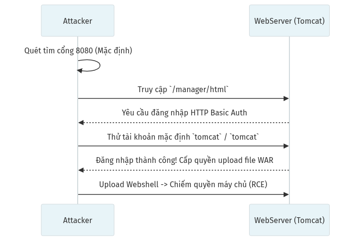

**Các bước khai thác:**
1. **[Kẻ tấn công]** rà quét tự động diện rộng trên Internet tìm cổng mặc định 8080.
2. Bắt gặp máy chủ Tomcat chưa đổi cấu hình xuất xưởng.
3. Đăng nhập cổng quản trị `/manager/html` với admin/pass là `tomcat/tomcat`.
4. Tải công cụ Hack (Webshell dạng file WAR) lên thẳng máy chủ.
5. Có trong tay toàn quyền điều khiển hệ thống (RCE).

### 6.1 Nguyên nhân
- Để nguyên mật khẩu mặc định của thiết bị/phần mềm (default credentials).
- Bật chế độ `Debug Mode` trên môi trường Production (Lộ sạch cấu hình, đường dẫn thư mục, API Key).
- Không cập nhật hệ điều hành, nền tảng (OS/Framework/DB) thường xuyên.
- Quên phân quyền thư mục, bật `Directory Listing` (Cho phép xem danh sách file trong một thư mục web như xem 1 folder trên Windows).

### 6.2 Phân loại và Khai thác
| Loại lỗi cấu hình | Mô tả & Khai thác |
|---|---|
| **Debug Mode On** | Laravel, Django khi báo lỗi sẽ in ra toàn bộ Database Password, AWS keys ra màn hình. |
| **Default Accounts** | Đăng nhập Admin Panel của Wifi Router, Camera, WordPress với pass `admin/admin`. |
| **Directory Listing** | Attacker gõ `site.com/uploads/` và thấy toàn bộ danh sách file nhạy cảm, mã nguồn `.git`. |

### 6.3 Rủi ro & Bug Bounty Report thực tế
- **Mức độ:** HIGH tới CRITICAL. Nếu cấu hình lộ file `.env` hoặc cho phép upload file do quên khóa quyền, hậu quả là RCE (Chiếm quyền máy chủ).
- **Case Study / Bug Bounty:**
  - Lộ file dự án, file cấu hình `.env` cho phép hacker tải về là lỗi sơ đẳng đem về vô số tiền thưởng trên HackerOne (thường rơi vào khoảng $1,500 - $3,000 tùy vào mức độ dữ liệu bên trong).

### 6.4 Cách khắc phục

**a) Tắt Debug/Dev Mode:**

| Framework | Cấu hình Production |
|---|---|
| **Laravel** | File `.env`: `APP_DEBUG=false`, `APP_ENV=production` |
| **Django** | File `settings.py`: `DEBUG = False`, `ALLOWED_HOSTS = ['yourdomain.com']` |
| **Express.js** | `NODE_ENV=production` (tắt tự động stack trace) |
| **Spring Boot** | `server.error.include-stacktrace=never` |

**b) Tắt Directory Listing:**
- Nginx: `autoindex off;` trong block `location`.
- Apache: Xóa `Indexes` khỏi `Options`: `Options -Indexes`.

**c) Chặn truy cập file nhạy cảm (Nginx):**
`location ~ /\.(env|git|htaccess|svn) { deny all; return 404; }`

**d) Security Headers:** Thêm vào cấu hình Nginx/Apache:
- `X-Content-Type-Options: nosniff`
- `X-Frame-Options: DENY`
- `X-XSS-Protection: 0` (dùng CSP thay thế)
- `Referrer-Policy: strict-origin-when-cross-origin`

**e) Thay đổi mật khẩu mặc định** của mọi dịch vụ (Tomcat, phpMyAdmin, Router, Camera) TRƯỚC khi deploy.

### 6.5 Cách phát hiện
| Công cụ | Manual Testing |
|---|---|
| Nikto, Nessus, Nmap (Quét cổng rác), DirBuster | Thử thêm `/admin`, `/login`, `/.env`, `/.git` vào URL. Cố tình nhập sai URL để lấy báo lỗi. |

---

## 7. XSS - CROSS-SITE SCRIPTING (CWE-79)

**Tóm tắt:** Kẻ tấn công tiêm mã JavaScript độc hại vào trang web hợp pháp. Mã này sẽ thực thi trên trình duyệt của *bất kỳ ai* truy cập trang đó.
**Ví dụ đời thường:** Giống như một kẻ chơi khăm dán một tờ giấy có tẩm thuốc mê lên bảng tin chung của trường. Bất cứ học sinh nào đứng lại đọc bảng tin chung sẽ tự động bị ngấm thuốc.

### Cơ chế hoạt động (Workflow: Stored XSS ăn cắp Cookie)

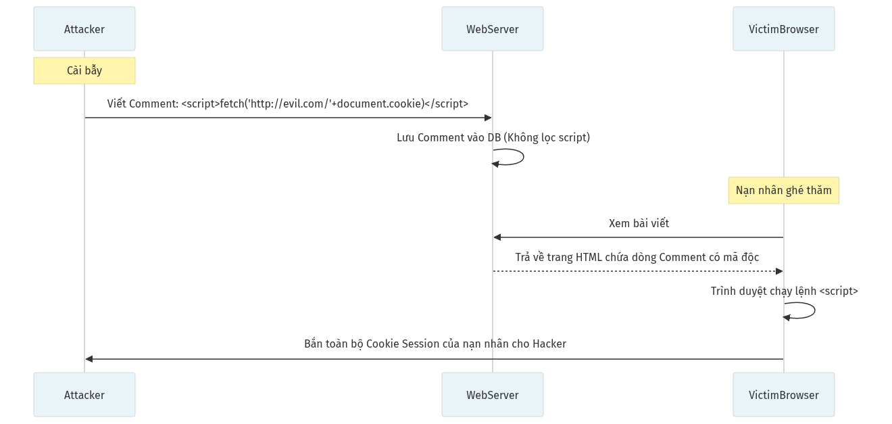

**Các bước khai thác:**
1. **[Kẻ tấn công]** Cố tình bình luận chứa mã nguồn độc `<script>...` vào bài viết.
2. **[Máy chủ]** lưu thẳng mã này vào Cơ sở dữ liệu mà không làm sạch (Escape).
3. **[Nạn nhân]** vô tình mở đọc bài viết đó.
4. HTML tải về báo cho Trình duyệt của nạn nhân tự động chạy lệnh Script ẩn.
5. Toàn bộ Session/Cookie của nạn nhân bị Script này tự động trích xuất gửi lén về máy chờ của Hacker.

### 7.1 Nguyên nhân
- Giao diện lấy dữ liệu từ DB, hoặc từ URL người dùng nhập vào và **render trực tiếp nguyên bản (raw HTML)** lên trình duyệt mà không qua `Encode` hay `Escape`.

### 7.2 Phân loại và Khai thác
| Loại XSS | Mô tả | Mức độ nguy hiểm |
|---|---|---|
| **Stored XSS** (Lưu trữ) | Payload XSS được lưu vĩnh viễn trong CSDL (như bình luận, Avatar, Tin nhắn). Hàng ngàn người có thể dính bẫy cùng lúc (Worm). | Cao nhất |
| **Reflected XSS** (Phản xạ) | Payload truyền qua tham số URL (VD: `?search=<script>...`). Attacker phải lừa nạn nhân click vào link chứa Payload. | Cao |
| **DOM-based XSS** | Payload chèn trực tiếp vào bộ nhớ DOM bằng JavaScript (VD: `document.innerHTML`). Không đi qua Backend. | Trung bình |

### 7.3 Rủi ro & Bug Bounty Report thực tế
- **Mức độ:** HIGH đến CRITICAL. XSS không chỉ dừng lại ở việc ăn cắp Cookie.
- **Hậu quả toàn diện:**
  - Đánh cắp Session/Cookie dẫn đến Account Takeover (ATO).
  - Giả mạo giao diện đăng nhập (Phishing nội bộ) để trộm mật khẩu.
  - Ghi lại mọi phím bấm của nạn nhân (Keylogger bằng JS).
  - Lan truyền như sâu mạng (Worm): 1 người dính → tự động lây sang hàng ngàn người khác.
  - **XSS dẫn đến RCE:** Trên các ứng dụng Desktop dựng bằng Electron (Discord, VS Code, Slack, Skype), XSS có thể leo thang thành RCE (chạy lệnh hệ điều hành) do Electron tích hợp Node.js. Ví dụ: CVE-2021-43908 (VS Code RCE qua XSS trong webview).
- **Case Study / Bug Bounty:**
  - **Samy Worm trên MySpace (2005):** Stored XSS lan truyền theo cấp số nhân, lây nhiễm hơn 1 triệu profile chỉ trong 20 giờ, tự động kết bạn với tác giả.
  - **Twitter onmouseover Worm (2010):** Chỉ cần rê chuột qua tweet là dính. Sâu mạng tự retweet và hiển thị popup trên hàng triệu tài khoản. Nguyên nhân: lỗi parse URL không escape ký tự đặc biệt.
  - **Twitter StalkDaily Worm (2009):** Tạo ra bởi hacker 17 tuổi, XSS worm tự thay đổi profile và đăng tweet quảng cáo trang StalkDaily.com trên mọi tài khoản bị lây.
  - **Vụ Uber XSS ($5,000 bounty):** XSS ẩn trong parameter `Next URL` giúp hacker chuyển tiền ảo của nạn nhân khi họ click link.
  - **Discord RCE (2020):** XSS trong embed iframe kết hợp Electron nodeIntegration cho phép chạy lệnh hệ thống trên máy tính nạn nhân.

### 7.4 Cách khắc phục

**a) Output Encoding (Biện pháp chính):**

| Framework | Cách tự động chống XSS |
|---|---|
| **React** | Tự động escape mọi biến trong JSX. **NGUY HIỂM:** `dangerouslySetInnerHTML` vô hiệu hóa bảo vệ này. |
| **Angular** | Tự động sanitize biến. **NGUY HIỂM:** `[innerHTML]` và `bypassSecurityTrust*`. |
| **Laravel Blade** | Dùng `{{ $var }}` (tự escape). **NGUY HIỂM:** `{!! $var !!}` in ra raw HTML. |
| **Django** | Template tự escape. **NGUY HIỂM:** `{{ var|safe }}` và ``. |
| **PHP thuần** | Luôn dùng `htmlspecialchars($input, ENT_QUOTES, 'UTF-8')` trước khi echo. |

**b) Content Security Policy (CSP Header):**
Thêm vào Response Header:
`Content-Security-Policy: default-src 'self'; script-src 'self'; style-src 'self' 'unsafe-inline'; img-src 'self' data:; object-src 'none'`
→ Cấm toàn bộ inline script và script từ nguồn lạ.

**c) Cookie bảo vệ chống ăn cắp:** `Set-Cookie: session=abc123; HttpOnly; Secure; SameSite=Lax`
- `HttpOnly`: JavaScript không đọc được cookie.
- `Secure`: Chỉ gửi qua HTTPS.

**d) Với Electron App:** Bắt buộc `nodeIntegration: false` và `contextIsolation: true` trong `webPreferences`.

### 7.5 Cách phát hiện
| Công cụ | Manual Testing |
|---|---|
| Dalfox, XSStrike, XSS Hunter, ZAP | Gõ payload đơn giản là dấu `<` và `>` hoặc nháy kép, theo dõi xem trang bị vỡ layout hay không. Nhập `<script>prompt(1)</script>` để thử nghiệm có hiển thị hộp thoại POPUP không. |

---

## 8. INSECURE COMPONENTS (CWE-1035)

**Tóm tắt:** Trang web của bạn thì an toàn, nhưng bộ thư viện bên thứ 3 (Plugin, Framework, Dependency) bạn tải về lại có lỗ hổng công khai (CVE).
**Ví dụ đời thường:** Bạn thuê một công ty bảo vệ xịn nhất cho nhà mình, nhưng vô tình thay một cái ổ khóa cửa chính của hãng vừa bị thu hồi vì khóa mở được bằng bất kỳ chìa nào.

### Cơ chế hoạt động (Workflow: Khai thác thư viện Log4j bị lỗi)

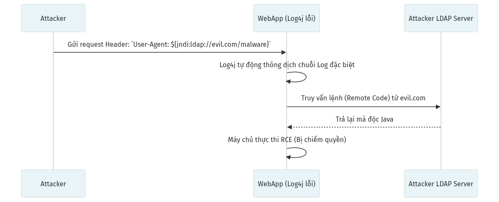

**Các bước khai thác:**
1. **[Kẻ tấn công]** xác định mục tiêu đang chạy phiên bản thư viện cũ dính lỗi (như Log4j v2.14).
2. Gửi gói tin nhồi nét mã dị dạng `${jndi:ldap...}` vào dòng thông tin Trình Duyệt (User-Agent).
3. Khi ghi nhật ký, hệ thống Log4j tự động giải nghĩa và triệu gọi kết nối tải tệp nhị phân từ máy chủ Hacker.
4. Mã độc tự động kích hoạt thẳng vào bộ nhớ máy chủ (RCE).

### 8.1 Nguyên nhân
- Dev sử dụng các thư viện mã nguồn mở, Plugin (WordPress) mà không liên tục cập nhật phiên bản vá lỗi.
- Sự thờ ơ với cảnh báo từ nền tảng (GitHub Dependabot).

### 8.2 Phân loại và Khai thác
| Đối tượng Vulnerability | Cách hacker đánh |
|---|---|
| **Framework Modules (Log4J, Struts2..)** | RCE (Chiếm server) chỉ qua một Request đặc biệt (như vụ trên). |
| **Server/OS** | Máy chủ chạy phiên bản PHP đời cũ có lỗ hổng buffer overflow, hoặc IIS lỗi. |
| **Frontend Libraries (jQuery < 3.x, ReactDOM)** | Xử lý chuỗi tạo nên DOM-based XSS. |

### 8.3 Rủi ro & Bug Bounty Report thực tế
- **Mức độ:** Từ Vừa đến RẤT NGHIÊM TRỌNG (Log4Shell có điểm CVSS 10.0 tuyệt đối).
- **Case Study / Bug Bounty:**
  - Vụ **Log4Shell (CVE-2021-44228)** - Lỗ hổng kinh hoàng tốn hàng tỷ đô để sửa trên toàn cầu, vì 90% phần mềm Java đều dùng Log4j. Hacker có thể chiếm Minecraft server, Apple iCloud chỉ qua 1 tin nhắn vào kênh chat.
  - HackerOne chi trên 4 triệu USD tiền nộp lỗi liên quan tới Log4Shell trong đúng 1 tháng cuối năm 2021.

### 8.4 Cách khắc phục

**a) Quét lỗ hổng tự động trong CI/CD:**

| Hệ sinh thái | Lệnh quét |
|---|---|
| **Node.js** | `npm audit` hoặc `npm audit fix --force` |
| **Python** | `pip-audit` hoặc `safety check` |
| **Java** | OWASP Dependency-Check: `mvn dependency-check:check` |
| **PHP** | `composer audit` (Composer 2.4+) |

- Tích hợp **Snyk** hoặc **GitHub Dependabot** vào repo để tự động tạo Pull Request cập nhật thư viện lỗi.
- Đặt lịch cập nhật dependency hàng tuần/tháng. Dùng Renovate Bot để tự động hóa.
- **Lock file:** Luôn commit `package-lock.json`, `Pipfile.lock`, `composer.lock` để đảm bảo phiên bản nhất quán.
- **SCA (Software Composition Analysis):** Dùng Snyk, Black Duck, hoặc FOSSA để quét bản quyền + lỗ hổng của mọi thư viện bên thứ 3.

### 8.5 Cách phát hiện
| Công cụ | Manual Testing |
|---|---|
| Snyk, OWASP Dependency Check, Wappalyzer | Dùng Wappalyzer soi công nghệ trang đang dùng có báo đỏ version cũ không. Quét lỗ hổng của Plugin CMS (Ví dụ: WPScan cho WordPress). |

---

## 9. INSUFFICIENT LOGGING & MONITORING (CWE-778)

**Tóm tắt:** Không có camera an ninh, bảo vệ ngủ gật. Thiếu việc ghi nhật ký máy chủ khiến kẻ thù lẻn vào tấn công, xóa dấu vết và rời đi mà quản trị viên không hề hay biết cho đến nhiều ngày sau.
**Ví dụ đời thường:** Cửa hàng bị trộm nhưng lại bảo: "Dữ liệu camera 3 tháng trước đã bị ghi đè, còn ban đêm bảo vệ không ghi sổ người ra vào".

### Cơ chế hoạt động (Workflow: Advanced Bruteforce & Bỏ qua Logging)

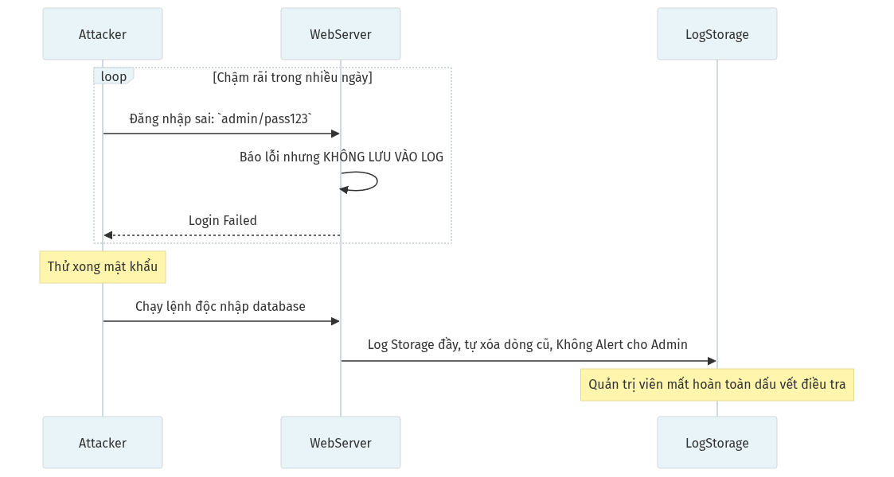

**Các bước khai thác:**
1. **[Kẻ tấn công]** tiến hành dò mật khẩu cực chậm (chia đều vài chục lần/ngày) qua nhiều máy ảo (IP) khác nhau để tránh WAF.
2. Máy chủ cẩu thả ghi nhận lỗi sai pass nhưng không thèm lưu log hoặc đẩy cảnh báo.
3. Đến khi rò trúng mật khẩu, Hacker tiến thẳng vào lấy Database.
4. Máy chủ Lưu Trữ quá tải, tự xóa log cũ. Admin tỉnh ngộ thì bằng chứng truy vết đã bị thủ tiêu hoàn toàn.

### 9.1 Nguyên nhân
- Ghi log (nhật ký) nhưng nội dung vô nghĩa, thiếu IP, thiếu Timestamp, thiếu UID người thao tác.
- Log lưu trữ tại chính Server bị hack (Khi hacker vào, việc đầu tiên là xóa file Log).
- Log chỉ để "xem cho vui" chứ không kích hoạt Cảnh báo (Alert/Notification) khi CÓ BIẾN.

### 9.2 Phân loại và Khai thác
Lỗ hổng này không đứng một mình, nó kết hợp với các lỗ hổng khác để tạo đủ thời gian cho hacker Rút Ruột hệ thống chậm rãi (Slow-Trench Attack) mà không "động rừng".

### 9.3 Rủi ro & Bug Bounty Report thực tế
- **Mức độ:** MEDIUM tới HIGH về khía cạnh quy trình. (Trung bình mất tới hơn 200 ngày doanh nghiệp mới phát hiện ra máy chủ mình đã bị thâm nhập lâu rồi, theo IBM Report).
- **Case Study / Bug Bounty:**
  - Năm 2014, một nhóm hacker Nga xâm nhập JPMorgan, hệ thống có cảnh báo nhưng nhân viên tưởng cảnh báo sai, không ai theo dõi log, dẫn đến 76 triệu hộ gia đình Mỹ bị rò rỉ dữ liệu.

### 9.4 Cách khắc phục

**a) Structured Logging (định dạng chuẩn):**
Mỗi dòng log phải có: **Timestamp, IP, User ID, Action, Result, Request ID**.
Ví dụ JSON log:
`{"time":"2024-01-15T10:30:00Z", "ip":"192.168.1.5", "user":"admin", "action":"LOGIN_FAILED", "detail":"wrong_password"}`

**b) Gửi log ra Server riêng (SIEM):**
- Công cụ phổ biến: **ELK Stack** (Elasticsearch + Logstash + Kibana), **Splunk**, **Graylog**, **Wazuh** (miễn phí).
- Cấu hình Nginx gửi log tập trung: `access_log syslog:server=siem.internal:514 main;`

**c) Cảnh báo tự động (Alerting):**
- Quy tắc cảnh báo: Login Failed > 10 lần/phút từ cùng IP → Gửi Telegram/Slack/SMS.
- Dùng **Fail2Ban** (Linux) tự động chặn IP sau 5 lần SSH/Login sai.
- Đặt Retention Policy: giữ log tối thiểu 90 ngày (GDPR yêu cầu lên đến 1 năm).

**d) Không bao giờ log dữ liệu nhạy cảm:** Mật khẩu, số thẻ CCCD, thẻ tín dụng TUYỆT ĐỐI không được xuất hiện trong log.

### 9.5 Cách phát hiện
| Công cụ | Manual Testing |
|---|---|
| Red Teaming / SOC Audit | Red Team chủ động tạo các payload tấn công tàn bạo vào máy chủ. Nếu hệ thống phòng thủ SOC hoặc IT không phản ứng/liên hệ lại, nghĩa là quy trình Monitoring là vô dụng. |

---

## 10. CSRF - CROSS-SITE REQUEST FORGERY (CWE-352)

**Tóm tắt:** Đánh lừa trình duyệt của nạn nhân tự động thực hiện một hành động (đổi mật khẩu, chuyển tiền) trên trang web *khác* mà nạn nhân đang đăng nhập. Mượn tay giết người.
**Ví dụ đời thường:** Bạn đưa cho sếp một tập hóa đơn mua vật tư. Sếp ký mà lười không đọc kỹ nội dung. Hóa ra trong tập hóa đơn đó, bạn kẹp sẵn một giấy ủy quyền nhà đất. Sếp ký xong là mất nhà.

### Cơ chế hoạt động (Workflow: Lừa chuyển khoản)

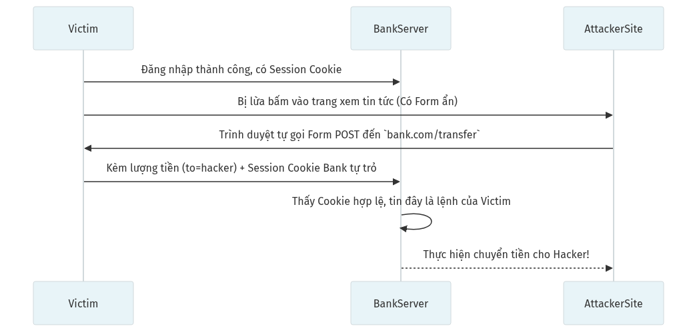

**Các bước khai thác:**
1. **[Nạn nhân]** đang ở trạng thái phiên Đăng nhập hợp lệ tại trang tài chính `bank.com`.
2. Vô tình lướt xem Web hài hước của Hacker. Web này chôn sẵn Form ẩn tự động Gửi lệnh `POST /transfer` dội thẳng về ngân hàng.
3. Trình duyệt ngây ngô tự động đắp kèm Session Cookie của `bank.com` vào gói Request do thói quen.
4. Cổng Ngân hàng nhận được lệnh Bơm Tiền đúng chuẩn, Cookie đúng chuẩn nên làm theo ngay tắp lự.

### 10.1 Nguyên nhân
- Kẻ tấn công tạo 1 website A. Website A ép trình duyệt gửi request sang Website B (Ngân hàng).
- Trình duyệt ngây thơ, luôn tự động độn kèm Session Cookie của Website B vào bất kỳ request nào gửi sang Web B, nên Web B tưởng nhầm lệnh này do chủ thẻ thực hiện.
- Máy chủ (Web B) **không sinh ra chuỗi Token ngẫu nhiên (CSRF Token)** riêng cho mỗi form giao dịch để chống giả mạo.

### 10.2 Phân loại và Khai thác
| Loại | Cách khai thác |
|---|---|
| **Simple Form POST** | Dùng thẻ HTML `<form action=".." method="POST" ...>` trong web độc. Để sẵn Javascript `body.onload=form.submit()`. Kéo nạn nhân duyệt trang đó là xong. |
| **GET Request Image** | Hacker đặt url vào ``. Trình duyệt khi tải ảnh sẽ tự kích hoạt url. |

### 10.3 Rủi ro & Bug Bounty Report thực tế
- **Mức độ:** HIGH đến CRITICAL. CSRF nguy hiểm hơn nhiều người nghĩ.
- **Hậu quả toàn diện:**
  - Đổi email/mật khẩu nạn nhân → Chiếm đoạt tài khoản vĩnh viễn (ATO).
  - Chuyển tiền, mua hàng trái phép dưới danh nghĩa nạn nhân.
  - Thêm tài khoản Admin mới, cấp quyền quản trị cho Hacker.
  - Xóa dữ liệu, vô hiệu hóa tài khoản hàng loạt.
- **Case Study / Bug Bounty:**
  - **Facebook ($2,500):** Lỗi đổi quyền Ad Account Admin do thiếu CSRF check.
  - **TikTok (2020):** CSRF kết hợp XSS cho phép gửi tin nhắn chứa mã độc và thực hiện hành động thay nạn nhân.
  - **Yahoo! (2022):** CSRF khai thác lỗi thiếu thuộc tính `SameSite` trên cookie, cho phép hacker đổi email + mật khẩu, chiếm đoạt tài khoản hoàn toàn.
  - **Bumble (HackerOne):** CSRF cho phép hacker liên kết tài khoản Gmail/Facebook của mình vào tài khoản nạn nhân, chiếm quyền kiểm soát.

### 10.4 Cách khắc phục

**a) Anti-CSRF Token:**
Mỗi form HTML phải kèm token ngẫu nhiên do server sinh ra. Website thứ 3 không biết token này nên không giả mạo được.

| Framework | Cách thêm CSRF Token |
|---|---|
| **Laravel** | Thêm `@csrf` vào mọi form Blade. Framework tự xử lý. |
| **Django** | Thêm `` vào form. Middleware `CsrfViewMiddleware` tự verify. |
| **Express.js** | Dùng thư viện `csurf`: `app.use(csrf({ cookie: true }))` |
| **Spring** | Mặc định bật. Thêm `<input type="hidden" th:name="${_csrf.parameterName}" th:value="${_csrf.token}"/>` |

**b) SameSite Cookie:**
Cấu hình cookie session: `Set-Cookie: session=abc; SameSite=Lax; Secure; HttpOnly`
- `SameSite=Lax`: Chặn cookie khi request cross-site POST (chống CSRF), cho phép GET thông thường.
- `SameSite=Strict`: Chặn mọi cross-site request (an toàn nhất nhưng có thể gây phiền khi click link từ email).

**c) Kiểm tra Origin/Referer Header:** So sánh `Origin` header của request với domain hợp lệ trước khi xử lý.

### 10.5 Cách phát hiện
| Công cụ | Manual Testing |
|---|---|
| Burp Suite Pro, ZAP | Thu chặn một request Đổi Email. Xóa thử dòng CSRF Token đi. Nếu máy chủ vẫn chấp nhận (200 OK), thì chắc chắn lỗi CSRF. |

---

## 11. OPEN REDIRECT (CWE-601)

**Tóm tắt:** Lỗ hổng cho phép kẻ tấn công sửa đổi địa chỉ trả về của website hợp lệ để điều hướng nạn nhân sang một trang giả mạo (Phishing).
**Ví dụ đời thường:** Một chiếc biển báo giao thông chính thức của nhà nước ghi: "Khu du lịch -> Đi theo biển chỉ dẫn dán đè của nhà hàng bên xóm." Bạn tin tưởng cái biển nhà nước, đi theo và bị chặt chém.

### Cơ chế hoạt động (Workflow: Phishing đánh cắp mật khẩu)

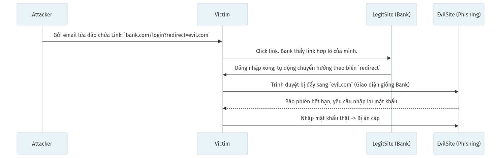

**Các bước khai thác:**
1. **[Kẻ tấn công]** tạo một liên kết chính hãng nhưng kẹp mồi nhử đổi hướng `bank.com/login?redirect=https://evil.com`.
2. Gửi Link dọa dẫm qua email. Tên miền đầu tiên là `bank.com` nên Nạn nhân mất cảnh giác click vào.
3. Trình duyệt qua cổng Login của bank, sau đó Hệ thống cẩu thả văng nạn nhân xuyên tới tên miền độc tài `evil.com`.
4. Lập tức Giao diện giả mạo giống hệt Web chính chủ hiện ra, báo "Hết hạn phiên", đòi Nạn nhân gõ lại Mật Khẩu, chiếm đoạt xong!

### 11.1 Nguyên nhân
- Ứng dụng nhận URL đích từ tham số GET (ví dụ: `?url=`, `?next=`, `?redirect_to=`) và gọi thẳng hàm Redirect mà không thèm kiểm tra xem URL đích có phải là Website hợp lệ hay không.
- Chỉ dùng hàm kiểm tra chuỗi đơn giản như `.startsWith()`, rất dễ bị vượt qua.

### 11.2 Phân loại và Khai thác
| Kỹ thuật Bypass (Vượt rào) | Ví dụ Khai thác |
|---|---|
| **Dấu `@` (User Authentication bypass)** | `https://bank.com?ret=https://bank.com@evil.com`<br>Theo chuẩn RFC, phần sau dấu `@` mới là hostname thực sự, nên trình duyệt sẽ điều hướng đến `evil.com`. |
| **Gạch chéo ngược (Backslash)** | `https://bank.com?url=//evil.com`<br>Trình duyệt tự nối thêm `http:` phía trước. |

### 11.3 Rủi ro & Bug Bounty Report thực tế
- **Mức độ:** MEDIUM tới HIGH. Thường được ghép chuỗi (Chain) với SSRF hoặc XSS để nhân đôi sát thương.
- **Case Study / Bug Bounty:**
  - Open Redirect giúp Hacker lừa lấy Token OAuth của người dùng (Token dùng để đăng nhập bằng Facebook/Google) - Những report này có thể lấy bounty hàng nghìn đô trên HackerOne (VD vụ Twitter trả $2,500 cho OAuth Token leakage via Open Redirect).

### 11.4 Cách khắc phục

**a) Không truyền URL đích qua tham số.** Thay bằng mã định danh:
- Thay `?next=https://site.com/dashboard` bằng `?next=dashboard`
- Backend map: `{"dashboard": "/user/dashboard", "profile": "/user/profile"}`

**b) Nếu bắt buộc dùng URL, kiểm tra bằng URL Parser chuẩn:**

| Ngôn ngữ | Code kiểm tra an toàn |
|---|---|
| **Python** | `from urllib.parse import urlparse`<br>`parsed = urlparse(redirect_url)`<br>`if parsed.netloc not in ALLOWED_DOMAINS: abort(400)` |
| **PHP** | `$host = parse_url($url, PHP_URL_HOST);`<br>`if (!in_array($host, $whitelist)) die('Blocked');` |
| **Node.js** | `const { hostname } = new URL(redirectUrl);`<br>`if (!allowedHosts.includes(hostname)) return res.status(400).send('Blocked');` |

- **Không dùng `.startsWith()` hay Regex đơn giản** — rất dễ bị bypass bằng ký tự `@`, `\\`, `%0d%0a`.

### 11.5 Cách phát hiện
| Công cụ | Manual Testing |
|---|---|
| Mắt thường, Burp Suite | Mọi tham số có dạng `next=`, `returnUrl=`, `continue=`, thử đổi thành tên miền `http://google.com` xem có bị bay sang trang Google không. |

---

## 12. SSRF - SERVER-SIDE REQUEST FORGERY (CWE-918)

**Tóm tắt:** Kẻ tấn công biến một Máy chủ Web hợp pháp thành công cụ (Proxy) để quét và gửi yêu cầu đến Mạng Nội Bộ (LAN) - nơi vốn được mã hóa và bảo vệ khắt khe không cho người ngoài vào.
**Ví dụ đời thường:** Bạn là ăn trộm, bạn gọi pizza đến nhà nạn nhân rồi giả danh giao hàng để đi qua cổng bảo vệ chung cư (Máy chủ Web đóng vai trò người giao Pizza).

### Cơ chế hoạt động (Workflow: Đánh cắp AWS Cloud Keys)


**Các bước khai thác:**
1. Lợi dụng tính năng "Tải ảnh đại diện từ Web khác", **[Kẻ tấn công]** truyền một URL trỏ về vùng cấm: `169.254.169.254` (Mạng nội bộ AWS).
2. **[Web Server]** đứng giữa đóng vai trò như cửa ải đi lấy hộ. Vì nó đứng sẵn trong mạng Cloud nội bộ, nên tường lửa không chặn.
3. Metadata chứa Root API Key và Secret Key của AWS Server bị bọc lại thành cái ảnh hỏng.
4. Server nôn thẳng gói Key này lên màn hình hiển thị "Quá trình Tải ảnh thất bại" làm lộ toàn bộ.

### 12.1 Nguyên nhân
- Tính năng Tải tệp từ URL ngoài (Download Image from URL), Import CSV from Link, hay Preview Link, Webhook của ứng dụng xử lý dữ liệu URL nhưng không chặn dải IP nội bộ.
- Server không có Tường lửa loại bỏ Outbound Traffic (Truy cập gửi ra ngoài).

### 12.2 Phân loại và Khai thác
| Phân loại | Cách thức khai thác |
|---|---|
| **Full / Basic SSRF** | Trả kết quả đọc mạng nội bộ hiện thẳng lên màn hình (Lỗi trên sơ đồ). |
| **Blind SSRF** | Gửi request đi nhưng màn hình không báo gì cả. Phải dùng thời gian trễ (Time-based payload) để đoán xem mạng nội bộ có máy chủ nào đang mở cổng rác không (Port Discovery). |

### 12.3 Rủi ro & Bug Bounty Report thực tế
- **Mức độ:** CRITICAL! SSRF là cánh cửa vào toàn bộ hạ tầng nội bộ.
- **Hậu quả toàn diện:**
  - Đọc AWS/GCP/Azure Metadata → Lấy trọn IAM Credentials → Chiếm toàn bộ Cloud Account.
  - Quét cổng mạng nội bộ (Internal Port Scanning) tìm dịch vụ ẩn (Redis, MongoDB, Docker API).
  - Kết nối tới Docker Socket nội bộ → Tạo container mới → Container Escape → RCE trên Host.
  - Kích hoạt dịch vụ nội bộ nhạy cảm (Admin Panel, Webhook, Database) mà tường lửa không chặn được.
  - Denial of Service (DoS) nội bộ: Bắn request ồ ạt vào server nội bộ làm sập hạ tầng.
- **Case Study / Bug Bounty:**
  - **Capital One (2019):** Rò rỉ hơn 100 triệu thẻ tín dụng do SSRF qua AWS Metadata. Hacker Paige Thompson lấy trọn quyền root của S3 bucket — vụ rò rỉ ngân hàng lớn nhất lịch sử Mỹ.
  - SSRF đọc Localhost file (`file:///etc/passwd`) luôn có Bounty từ $5,000 tới $15,000 tuỳ mức độ hạ tầng.
  - **Shopify ($25,000):** SSRF qua tính năng Import CSV cho phép quét toàn bộ mạng nội bộ GCP của Shopify.

### 12.4 Cách khắc phục

**a) Chặn IP/URL nội bộ (Blocklist):**

| Ngôn ngữ | Code chặn SSRF |
|---|---|
| **Python** | `import ipaddress`<br>`ip = ipaddress.ip_address(resolved_ip)`<br>`if ip.is_private or ip.is_loopback: raise Exception('SSRF blocked')` |
| **Node.js** | Dùng thư viện `ssrf-req-filter`: `const fetch = require('node-fetch'); const filter = require('ssrf-req-filter');` |

- Chặn toàn bộ dải: `127.0.0.0/8`, `10.0.0.0/8`, `172.16.0.0/12`, `192.168.0.0/16`, `169.254.169.254`, `0.0.0.0`.
- Chặn scheme nguy hiểm: `file://`, `gopher://`, `dict://`, `ftp://`.

**b) DNS Resolution Check:** Resolve tên miền TRƯỚC khi fetch, sau đó kiểm tra IP có thuộc dải nội bộ không (chống DNS Rebinding).

**c) Network Layer:** Cấu hình Firewall chặn Outbound traffic từ Application Server đến dải IP nội bộ.

**d) AWS IMDSv2:** Bật IMDSv2 trên AWS EC2 (yêu cầu token để truy cập metadata, chống SSRF đơn giản):
`aws ec2 modify-instance-metadata-options --instance-id i-xxx --http-tokens required`

### 12.5 Cách phát hiện
| Công cụ | Manual Testing |
|---|---|
| SSRFMap, Burp Collaborator | Bất kỳ luồng tính năng Import/Download bằng Link, điền thử `http://localhost:22` xem nó có báo lỗi Port Close hay Open không. |

---

## 13. SSTI - SERVER-SIDE TEMPLATE INJECTION (CWE-1336)

**Tóm tắt:** Mã độc được chèn ngay vào bộ khung Giao diện (Template Engine) của máy chủ trước khi nó tạo ra file HTML cuối cùng. Do Template có quyền truy cập hệ thống, lỗ hổng này biến thành RCE chạy lệnh HĐH.
**Ví dụ đời thường:** Giống việc gửi mã lệnh kỹ thuật vào mục tên người nhận thiệp cưới (Ví dụ nhập tên là `<script>Sập nguồn máy in</script>`). Máy in tự động đọc cái tên và bị treo máy.

### Cơ chế hoạt động (Workflow: Thực thi Python)

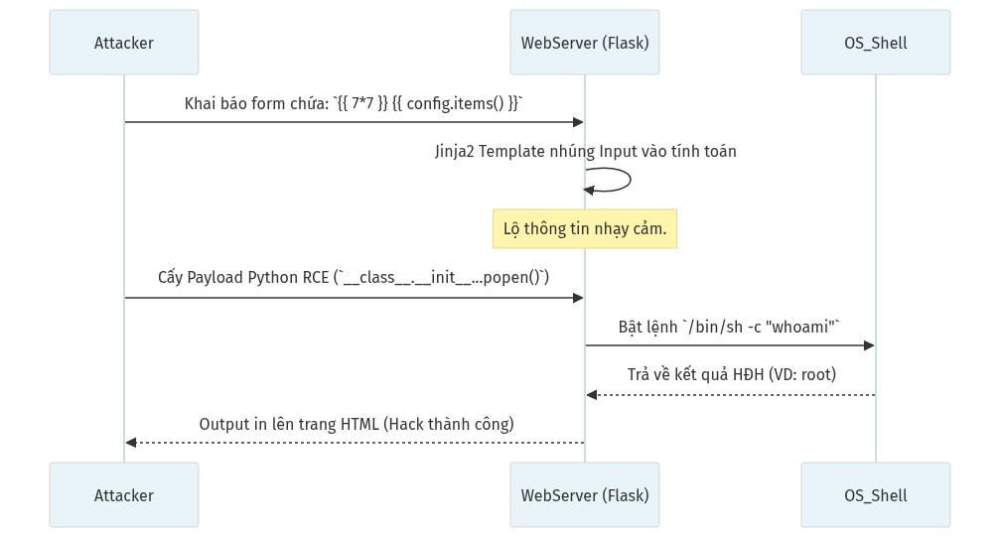

**Các bước khai thác:**
1. **[Kẻ tấn công]** lợi dụng Form tùy biến (Ví dụ Điền Tên hoặc Mẫu Thư) bằng cú pháp Biểu thức Template `{{ 7*7 }}`.
2. Framework phía máy chủ (như Jinja2) nhận Input, vô tình nhúng nó thành Cú pháp Thực thi trực tiếp, kết quả in ra `49`.
3. Hacker bồi tiếp chuỗi lệnh độc hiểm (`__class__...os.popen`) kế thừa vòng quay Môi trường Python gốc.
4. Tầng Hệ Điều Hành bộc phát Lệnh Terminal. RCE Thành Công bẻ khóa ứng dụng rớt lớp vỏ bảo vệ.

### 13.1 Nguyên nhân
- Dev sử dụng hàm thay thế chuỗi trực tiếp (`render_template_string(user_input)`) thay vì truyền Biến qua Context chuẩn. Hệ thống Framework (Jinja2, Twig, Freemarker, Smarty) vô tình biên dịch và thực thi câu lệnh.

### 13.2 Phân loại và Khai thác
Lỗ hổng SSTI phụ thuộc hoàn toàn vào Ngôn ngữ Lập trình:
| Ngôn ngữ / Framework | Cú pháp Payload thử nghiệm | Payload Độc |
|---|---|---|
| **Python (Jinja2 / Flask)**| `{{ 7*7 }}` -> In ra 49 | Dùng chuỗi Popen mượn module OS chạy mã Lệnh (Rất dài, xem docs). |
| **Java (Freemarker)** | `${7*7}` -> In ra 49 | Lợi dụng `Execute()` |
| **Ruby (ERB)** | `<%= 7*7 %>` -> In ra 49 | `require('os')....` |

### 13.3 Rủi ro & Bug Bounty Report thực tế
- **Mức độ:** MỘT TRONG NHỮNG LỖI CRITICAL ĐÁNG SỢ NHẤT. Hậu quả tức thì là RCE toàn bộ máy chủ (Giống SQLi).
- **Case Study / Bug Bounty:**
  - Lỗ hổng Apache Solr Velocity Template (CVE-2019-17558) - Gây chấn động hàng nghìn doanh nghiệp vì cho phép RCE từ xa qua SSTI.
  - Hàng trăm bài viết Bug Bounty nhận $10,000+ trên Uber, Yahoo khi Hacker phát hiện hệ thống Email Marketing của họ cho phép soạn thảo nội dung theo cú pháp Template của Freemarker/Velocity.

### 13.4 Cách khắc phục

**a) Tách biệt User Input khỏi Template Code:**

| Framework | Code Lỗi | Code An Toàn |
|---|---|---|
| **Flask/Jinja2** | `render_template_string(user_input)` | `render_template('page.html', name=user_input)` |
| **PHP/Twig** | `$twig->createTemplate($userInput)->render()` | `$twig->render('page.html', ['name' => $userInput])` |

- Nguyên tắc: User Input chỉ được truyền làm **biến dữ liệu** (context variable), không bao giờ được nhúng làm **mã template**.

**b) Sandbox cho Template:** Nếu cho phép user tự thiết kế email template:
- Jinja2: Bật `SandboxedEnvironment` (chặn truy cập `__class__`, `__subclasses__`).
- Twig: Bật `sandbox` extension và chỉ cho phép whitelist các filter/function an toàn.

**c) Dùng Logic-less Template (Mustache, Handlebars):** Các engine này không hỗ trợ thực thi code, chỉ thay thế biến đơn thuần.

### 13.5 Cách phát hiện
| Công cụ | Manual Testing |
|---|---|
| Tplmap | Cố gắng nhập các chuỗi ngoặc nhọn toán học `{{ 4 * 4 }}` hoặc `[[ 5 * 5 ]]` vào mọi form gửi thư, thiết lập Tên hồ sơ, Đặt hàng. Xem trang web có tự động tính toán ra kết quả `16` hay `25` không. |

---

## 14. DIRECTORY TRAVERSAL (CWE-22)

**Tóm tắt:** Lỗ hổng cho phép gõ thêm các ký tự lùi thư mục (`../`) để "Đi xuyên tường" thư mục Web, đọc được các tệp tin lưu sâu hơn ở hệ điều hành của Máy chủ (như `/etc/passwd`).
**Ví dụ đời thường:** Giống như người thuê trọ ở Phòng số 5, đi vào bồn rửa mặt, tháo tung đường ống, chui qua ống đồng dẫn nước leo vào két sắt của Chủ nhà.

### Cơ chế hoạt động (Workflow: Đọc mã nguồn)

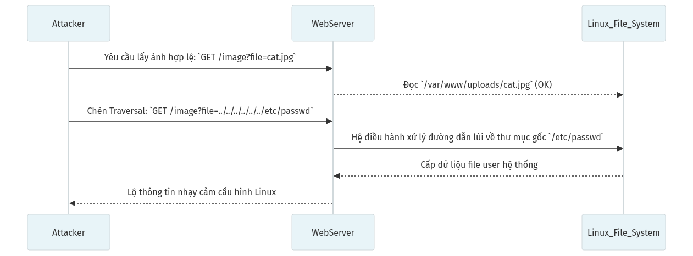

**Các bước khai thác:**
1. **[Kẻ tấn công]** nhìn thấy Web đang cung cấp dịch vụ đọc file qua URL `?file=avatar.jpg`.
2. Khéo léo chèn chuỗi ký tự lùi thư mục (Path Traversal): `../../../../../../etc/passwd`.
3. API lấy file của hệ thống bỏ qua bước xử lý dọn dẹp biến, đè nguyên đường dẫn gộp lại kéo tuột về tận Thư Mục Gốc của Linux.
4. Nội dung nhạy cảm của Linux Config trào ra ngoài giao diện công cộng qua ngõ File Download!

### 14.1 Nguyên nhân
- Mọi chức năng Lấy ảnh, Lưu ảnh, Đọc văn bản sử dụng biến của User (Tên tệp) ghép nối thuần với Thư mục Gốc mà KHÔNG XÓA SẠCH chuỗi dấu chấm (`../`).

### 14.2 Phân loại và Khai thác
| Kỹ thuật Lách luật (Bypass) | Giải thích |
|---|---|
| **Mã hóa URL** | Đổi ../ thành `%2e%2e%2f`. |
| **Mã hóa URL kép (Double Encoding)** | Đổi ../ thành `%252e%252e%252f` (qua mắt WAF). |
| **Bypass Xóa 1 lần** | Payload `....//`. Nếu server chỉ cấm chuỗi `../` 1 lần thì chuỗi này sẽ bị xóa phần lõi, vô tình khớp lại vỏ ngoài thành `../` chuẩn. |

### 14.3 Rủi ro & Bug Bounty Report thực tế
- **Mức độ:** HIGH (nếu lộ Database Info như `.env`), CRITICAL (nếu kết hợp với File Upload tệp mã độc lên rồi đọc/kích hoạt - RCE).
- **Case Study / Bug Bounty:**
  - VPN nổi tiếng của Fortinet và Pulse Secure bị lộ lỗ hổng Traversal năm 2019, giúp cho các nhóm Ransomware toàn cầu lọt vào hàng chục nghìn công ty để đòi tiền chuộc (Đọc file cấu hình chứa VPN Password Plaintext).

### 14.4 Cách khắc phục

**a) Không bao giờ dùng tên file từ client để truy cập filesystem:**
- Lưu file với UUID làm tên: `uuid4() + ".jpg"`. Map UUID → file thật trong DB.

**b) Chuẩn hóa đường dẫn (Path Canonicalization):**

| Ngôn ngữ | Code chống Traversal |
|---|---|
| **Python** | `import os`<br>`safe_path = os.path.realpath(os.path.join(BASE_DIR, filename))`<br>`if not safe_path.startswith(BASE_DIR): abort(403)` |
| **PHP** | `$real = realpath($upload_dir . '/' . basename($_GET['file']));`<br>`if (strpos($real, $upload_dir) !== 0) die('Blocked');` |
| **Java** | `Path path = Paths.get(baseDir, fileName).normalize();`<br>`if (!path.startsWith(baseDir)) throw new SecurityException();` |

- **`basename()`** là hàm chặt bỏ mọi `/` và `\\` khỏi tên file, rất hữu ích làm lớp phòng thủ đầu tiên.
- Cấu hình Nginx: `location /uploads/ { internal; }` — chỉ cho phép truy cập qua backend proxy, không cho truy cập trực tiếp.

### 14.5 Cách phát hiện
| Công cụ | Manual Testing |
|---|---|
| DotDotPwn, Burp Suite Intruder | Nhét Wordlist chứa đủ kiểu kết hợp `....//; %2e` vào Parameter Download, Test API gọi tệp tin. Nếu trả về chuỗi nội dung `root:x:0:0` là thành công. |

---

## 15. FILE INCLUSION / LFI / RFI (CWE-98)

**Tóm tắt:** "Bao thầu" tệp tin độc hại. Trang web nhúng cả file mã nguồn của kẻ tấn công (thậm chí host tệp ở Mỹ, gọi từ máy chủ tại Việt Nam) khiến mã độc được chèn nhập vào và Đun nấu ngay lập tức (RCE).
**Ví dụ đời thường:** Bạn gọi một chuyên gia về nhà lắp TV. Nhưng do bạn không kiểm tra thẻ ngành, kẻ lừa đảo trà trộn vào nhà giả danh chuyên gia, rồi cậy tung két sắt thay vì lắp tivi.

### Cơ chế hoạt động (Workflow: LFI to RCE PHP Wrappers)

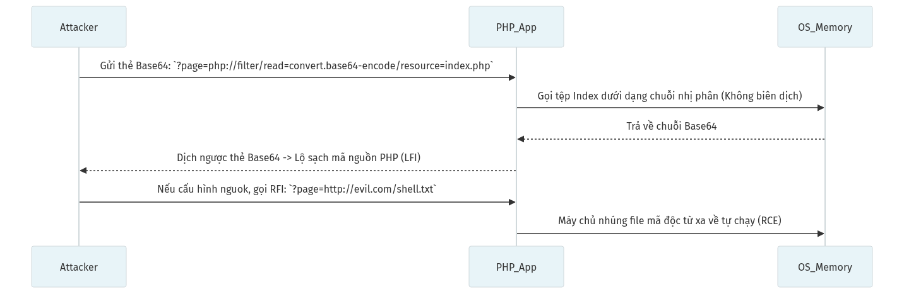

**Các bước khai thác:**
1. Đánh hơi thấy Web PHP dựa vào biến Tham Số `?page=` để nhúng ruột giao diện (ví dụ `page=home.php`).
2. **[Kẻ tấn công]** lợi dụng tính năng Ống dẫn Data (Filter Wrapper) gõ `php://filter/read=convert.base64-encode/resource=index.php`.
3. Thay vì cho PHP dịch file để chạy ẩn Code, Lõi PHP lại bị Ép nhổ toẹt nội dung mã nguồn dưới dạng Chuỗi Text mã hóa Base64.
4. Decode đoạn Base64, Database Config và Mật khẩu Quản trị Database lọt vào tay giặc.

### 15.1 Nguyên nhân
- Hầu hết gặp trên Ứng dụng PHP do đặc tính kiến trúc module động `include()`, `require()` hoặc `include_once()` kết hợp với đầu vào biến thiên `?page=user_input`.
- Đôi khi Web cẩu thả cấu hình ngược `allow_url_include=On` trong file `php.ini` (Sinh ra lỗ hổng Remote File Inclusion - RFI).

### 15.2 Phân loại và Khai thác
Đỉnh cao của LFI là lợi dụng các "Wrapper - Ống Bọc" trong Hệ Thống để RCE:
| Tên Wrapper (PHP) | Mục đích Khai thác |
|---|---|
| **`php://filter`** | Dùng để Ép Đọc nội dung mã nguồn (.php) dưới dạng văn bản txt (Base64) thay vì Máy chủ biên dịch chạy rỗng. |
| **`data://text/plain`** | Thực thi trực tiếp chuỗi nhúng. Bơm PHP ngay tại thanh URL. (VD: `data://text/plain,<?php system('whoami');?>`) |
| **`php://input`** | Đọc dữ liệu từ Body Request HTTP (Dùng để thả Payload vào qua Burp Suite). |
| **`expect://`** | Thực thi lệnh OS trực tiếp nếu ứng dụng chịu bật extension bậy bạ. |

### 15.3 Rủi ro & Bug Bounty Report thực tế
- **Mức độ:** CRITICAL (Đỉnh chóp). Remote Code Execution là chuyện Dĩ nhiên.
- **Case Study / Bug Bounty:**
  - Hàng đống mã nguồn vBullentin, Joomla v4.x đời cũ đã chết hàng loạt bởi những lỗi File Inclusion 0-Day ở Modules ảnh hưởng đến trăm nghìn Web tin tức (2015-2018).
  - Khai thác kiểu Poisoning: LFI đọc nhầm tệp `access_log`. Hacker thả mã độc PHP vào `User-Agent` HTTP header. Khi kết hợp cùng LFI, mã độc bung nở. (Kỹ thuật này siêu Hot thi OSCP Cert).

### 15.4 Cách khắc phục

**a) Thay include động bằng whitelist tĩnh:**
```php
<?php
$allowed = ['home', 'about', 'contact'];
$page = $_GET['page'] ?? 'home'; // Default to 'home' if not set

if (in_array($page, $allowed)) {
    include($page . '.php');
} else {
    // Handle invalid page request, e.g., show 404 or redirect to home
    include('home.php');
}
?>
```

**b) Cấu hình php.ini chống LFI/RFI:**
- `allow_url_include = Off` (chặn RFI hoàn toàn).
- `allow_url_fopen = Off` (chặn đọc URL từ xa).
- `open_basedir = /var/www/html` (giới hạn PHP chỉ đọc file trong thư mục web).

**c) Vô hiệu hóa PHP Wrapper nguy hiểm** bằng cách tắt `expect` extension và giới hạn `stream_wrappers`.

### 15.5 Cách phát hiện
| Công cụ | Manual Testing |
|---|---|
| LFISuite, Burp Intruder | Thử gọi các Parameter thay đổi Page/Layout như `view=`, `lang=`, `file=`, `page=`. Kẹp Base64 Wrapper vào nếu màn hình trả về Chuỗi rác (Mã hóa) dài vô hạn nghĩa là nó có thể đọc source code. |

---

## 16. INSECURE / UNRESTRICTED FILE UPLOAD (CWE-434)

**Tóm tắt:** Trang web cho phép người dùng tải lên Tệp tin (File) nhưng không kiểm tra kỹ nội dung, dẫn đến việc kẻ tấn công tải lên một file Mã độc (Webshell) và biến máy chủ thành trạm điều khiển của chúng.
**Ví dụ đời thường:** Sân bay cho phép khách hàng mang hành lý ký gửi. Nghe nói khách mang vali quần áo thì cho qua luôn máy soi chiếu, khách mang ma túy nhét trong rỗng đáy vali qua an toàn.

### Cơ chế hoạt động (Workflow: Upload Webshell RCE)

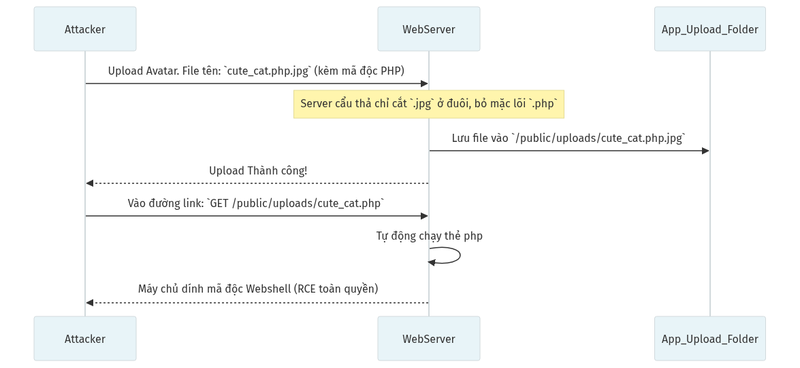

**Các bước khai thác:**
1. **[Kẻ tấn công]** nén mã độc Shell PHP điều khiển lệnh HĐH vào một file giấu đuôi (như `shell.php.jpg`).
2. Upload vào Hệ thống. Quá trình kiểm tra sơ sài chỉ cắt phần đuôi .jpg và Cho Qua.
3. Tệp ngự trị ở thư mục Nginx (như `/uploads/`) nơi Động Cơ PHP vẫn không bị vô hiệu hóa.
4. Hacker đánh vào đường link chứa file, file bừng tỉnh và kích nổ luồng Shell kiểm soát rốt ráo mọi chức năng HĐH (RCE).

### 16.1 Nguyên nhân
- Lập trình viên phó mặc việc kiểm tra đuôi Tệp tin (Extension) cho Client-Side (JavaScript). Hacker dễ dàng tắt JS đi hoặc Dùng Burp Suite tráo đổi (MIME Type).
- Cho phép tập tin lưu vào thư mục `WebRoot` (VD: /public) khiến Tệp có khả năng được kích hoạt công khai khi gọi đường dẫn URL. Máy chủ không vô hiệu hóa module thông dịch chạy ngôn ngữ (PHP/Python/Perl) tại thư mục đó.

### 16.2 Phân loại và Khai thác
| Kỹ thuật qua mặt (Bypass) | Ý nghĩa Hành động cắm Webshell |
|---|---|
| **Thay Content-Type** | Trong Gói tin (Burp), sửa Content-Type thành `image/jpeg` hoặc `image/png` dẫu lõi thân tệp vẫn là cấu trúc `<?php...?>`. |
| **Kỹ xảo Chèn Đuôi** | `shell.php.jpg`, `shell.php%00.jpg`, `admin.phtml`, `config.php5`. Lợi dụng lỗ hổng Parser của Apache/Nginx. |
| **Ghép Magic Byte** | Điền 3 chữ `GIF89a` ở dòng đầu tệp mã nguồn PHP. Server sẽ đo bằng hàm đọc Magic Byte và bị lừa đây đích thị là ảnh GIF. |

### 16.3 Rủi ro & Bug Bounty Report thực tế
- **Mức độ:** CRITICAL! Chắc chắn 100% là Lật Máy Chủ (Full Server Compromise - RCE).
- **Case Study / Bug Bounty:**
  - Năm 2021, Lỗ hổng Upload File chấn động trên Microsoft Exchange Server (ProxyLogon - CVE-2021-26855) kéo theo tình trạng cả ngàn Doanh nghiệp bị thả Ransomware. Hacker leo vọt thẳng lên quyền SYSTEM của Windows Server.
  - HackerOne chi trả hàng nghìn USD cho những lỗi File Upload vô tình bỏ qua `Magic Bytes`, tiêu biểu có vụ Shopify bị upload file SVG chứa XSS ($1,000+).

### 16.4 Cách khắc phục

**a) Kiểm tra file upload nhiều lớp (Defense in Depth):**

| Lớp kiểm tra | Cách làm |
|---|---|
| **Extension Whitelist** | Chỉ cho phép: `.jpg`, `.png`, `.gif`, `.pdf`. Cấm mọi đuôi khác. |
| **MIME Type Check** | Kiểm tra `Content-Type` và Magic Bytes (`finfo_file()` trong PHP). |
| **Đổi tên file** | Dùng UUID: `$newName = uuid4() . '.jpg';` — Không bao giờ giữ tên gốc. |
| **Giới hạn kích thước** | `client_max_body_size 5M;` (Nginx). |

**b) Lưu file ngoài WebRoot:**
- Lưu vào `/var/uploads/` (không nằm trong `/var/www/html/`).
- Hoặc dùng Cloud Storage: AWS S3, GCS với pre-signed URL.

**c) Vô hiệu hóa thực thi code tại thư mục uploads (Nginx):**
`location /uploads/ { location ~ \.php$ { deny all; } }`

**d) Re-encode ảnh:** Dùng thư viện ảnh (Pillow, ImageMagick) để đọc và ghi lại ảnh — loại bỏ mọi payload ẩn trong metadata/EXIF.

### 16.5 Cách phát hiện
| Công cụ | Manual Testing |
|---|---|
| Tự Động Phân Tích (WAF Logs) | Thả các đuôi nguy hiểm như `.pHp`, `.aspX`, `.jsp` qua tính năng Update Ảnh Đại Diện. Nếu Server rớt ra đường link ảnh đó và Truy cập hiện trắng trang, nghĩa là Lỗi Đã Được Kích Hoạt. |

---

## 17. CLICKJACKING / UI REDRESSING (CWE-1021)

**Tóm tắt:** Kẻ tấn công biến khuôn mặt trang web của mình thành "Trong suốt tàng hình" và phủ nó lên trên 1 trang web nổi tiếng. Người dùng định bấm Share ảnh trên trang nổi tiếng, hóa ra lại đang bấm nút "Chuyển tiền" của trang giả mạo. Cú lừa thị giác.
**Ví dụ đời thường:** Bạn ký vào một tờ giấy "Xin nghỉ phép" do đồng nghiệp đưa. Nhưng sau lưng tờ giấy đó có kẹp giấy than, thế là bạn từ từ "Ký nhầm" vào Giấy Vay Nợ.

### Cơ chế hoạt động (Workflow: Lừa xóa tài khoản)

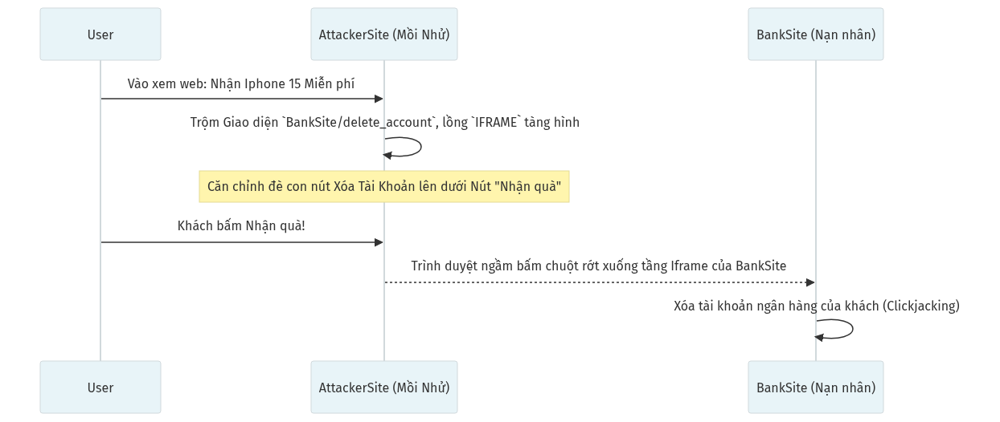

**Các bước khai thác:**
1. **[Kẻ tấn công]** xây một Giao diện Nhận Quà Khuyến Mãi mồi chài nhấp chuột.
2. Dùng thẻ `<IFRAME>` phủ thầm một lớp giao diện (Mờ hoàn toàn cực kỳ tàng hình) bốc nguyên Khung Xóa Tài khoản của `Bank.com` chèn lên đó.
3. Canh chỉnh vị trí khéo léo để Phím "Chấp nhận giải thưởng" khớp với Tọa Độ Nút "Xóa Acc" trong Iframe nền.
4. **[Nạn nhân]** hớn hở click chuột. Cú nhấp xuyên qua Web Thật xuống tận Web Ẩn, nảy sinh Hậu quả Mất Mát nặng nề.

### 17.1 Nguyên nhân
- Trang web quên gắn Header bảo mật cấm các trang khác "Nhúng" nó vào Iframe (`X-Frame-Options` hoặc `Content-Security-Policy: frame-ancestors`).
- Đồng thời Website đó có chức năng Đăng Nhập mà Cookie duy trì ở trạng thái mỏng manh, không bật Flag `SameSite`. 

### 17.2 Phân loại và Khai thác
Thiết kế trang HTML mồi nhử bằng các lệnh định hình CSS như `z-index`, `opacity: 0`, `position: absolute`. Kéo thả khung Iframe trong suốt trúng vị trí con trỏ chuột.

| Kiểu Lừa Đảo | Hành động đạt được |
|---|---|
| **Likejacking / Sharejacking** | Lừa trên thiết bị di động. Nút ấn Facebook/Twitter Share bị giấu vào Iframe tàng hình. |
| **Mouse-chasing (Bẫy chuột)** | Viết kịch bản JS cho Iframe tàng hình lúc nào cũng Di Chuyển Lơ lửng bám dính dưới gót con trỏ chuột. Client nhấp đúp là dính. |

### 17.3 Rủi ro & Bug Bounty Report thực tế
- **Mức độ:** MEDIUM tới HIGH (Phụ thuộc vào Hành Động Bị Click Trúng (VD Xóa user, Cấp Token, Like dạo)).
- **Case Study / Bug Bounty:**
  - Vụ Đánh Cắp Hàng Triệu Lượt Like Facebook năm 2011/2012 do thiếu Frame cấm nhúng (Facebook đã tung mã sửa Frame-busting).
  - Nhiều trường hợp Clickjacking lừa Victim Tự động Chuyển Trạng Thái Tài Khoản Quản Trị, đạt Bounty ~$500 - $1,000 trên Bugcrowd/HackerOne.

### 17.4 Cách khắc phục

**a) X-Frame-Options Header:**
- Nginx: `add_header X-Frame-Options "DENY" always;` (cấm mọi iframe).
- Hoặc `"SAMEORIGIN"` nếu cần nhúng iframe cùng domain.

**b) CSP frame-ancestors (tiêu chuẩn mới, khuyến nghị dùng):**
- Nginx: `add_header Content-Security-Policy "frame-ancestors 'none';" always;`
- Cho phép domain cụ thể: `frame-ancestors 'self' https://trusted-partner.com;`

**c) Cấu hình Apache:**
`Header always set X-Frame-Options "DENY"`
`Header always set Content-Security-Policy "frame-ancestors 'none'"`

**d) JavaScript Frame-busting (lớp phòng thủ bổ sung):**
`if (window.top !== window.self) { window.top.location = window.self.location; }`

### 17.5 Cách phát hiện
| Công cụ | Manual Testing |
|---|---|
| Mở mã nguồn bằng F12, Burp Suite, Clickjacking PoC Tool | Lưu một file `test.html` có đoạn dán Iframe gọi URL của Website Mục Tiêu. Mở băng Chrome, Nếu hiển thị ra Web, nghĩa là Web này chịu tổn thương Clickjacking. Nếu báo lỗi Chrome refuse to connect, Web an toàn. |

---

## 18. CORS MISCONFIGURATION (CWE-942)

**Tóm tắt:** CORS là cơ chế an ninh mở cửa giữa 2 Tên miền khác nhau. Nếu Cấu hình sai, Kẻ tấn công có thể dựng một Trang Web lừa đảo, ép trình duyệt Khách hàng đi chôm chỉ dữ liệu Kín (Cá nhân) ở Tên miền của bạn và gửi về cho Hacker.
**Ví dụ đời thường:** Bạn cấu hình khóa cửa bảo mật vân tay của công ty, nhưng lại dán nilon dòng chữ "Mọi vân tay lạ đều mở được cửa" (`Origin: *`), khiến người đi ngang qua cũng mở được máy chủ nội bộ.

### Cơ chế hoạt động (Workflow: Ăn cắp Token Nội bộ qua trình duyệt)

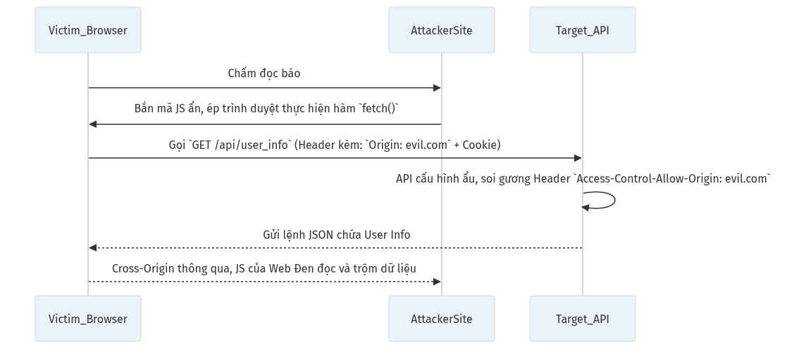

**Các bước khai thác:**
1. Nhận ra App Ngân Hàng cấu hình Cửa CORS quá thoáng đãng (`Access-Control-Allow-Origin` vô tư trả Gương Mọi Nguồn).
2. **[Kẻ tấn công]** soạn Web Rác (evil.com) giấu đoạn Script âm thầm tự fetch luồng dữ liệu bảo mật từ Api App Mật.
3. Trình duyệt của Nạn nhân khi đang vi vu lướt qua Web Rác, bị Lệnh Script dội ép Cấp Data lên Host Đích (cùng đúp thêm Cookie Ngân Hàng).
4. Data xả hàng về trọt, Trình Duyệt chấp thuận vì Cấu hình App Đích tự bóp chính mình. Lộ sạch Token Data rinh qua Web Hacker.

### 18.1 Nguyên nhân
- Same-Origin Policy (SOP) sinh ra để ngăn vụ đọc chéo Tên miền (Ăn cắp bằng Ajax/Fetch). 
- Nhưng Lập trình viên lười biếng, cấu hình API bằng lệnh `Access-Control-Allow-Origin: *` (Dấu hoa thị: Khớp mọi Tên Miền) hoặc Reflect (Gương phản chiếu: Tự động Bê nguyện Chuỗi Tên Miền Truy Vấn đắp vào Câu Trả Lời) mà Bỏ quên Cơ chế Lọc danh sách an toàn.
- Nếu Cặp lệnh `Credentials: True` gộp với `Origin` phản chiếu nhầm lẫn sẽ tạo Thảm Họa.

### 18.2 Phân loại và Khai thác
| Cấu hình sai chết người | Tại sao Hacker Thích Nhất? |
|---|---|
| **Origin Reflection (Khớp động mù quáng)** | Web Server phản hồi lại bất kỳ Origin nào nó nhận được (Bê nguyên chuỗi `evil.com`). Payload Javascript Fetch() của hacker dùng `withCredentials=true` để cuỗm toàn bộ Email, User Data. |
| **Trusting Subdomains (Regex lõm)** | Cấu hình cho phép `*.bank.com`. Hacker tạo một trang có tên miền là `hackbank.com` hoặc lừa lấy Subdomain bị bỏ quên `forum.bank.com` tạo mồi câu JS. |
| **Trusting "null"** | Khi Iframe cục bộ (File lồng nhau) gửi Origin, Origin sẽ là `null`. Server ngu ngốc khai báo `Allow-Origin: null`. Hacker thả file HTML vào trình duyệt để lách luật. |

### 18.3 Rủi ro & Bug Bounty Report thực tế
- **Mức độ:** HIGH (Sát sườn với Account Takeover nếu Lộ GraphQL User Info/AccessToken).
- **Case Study / Bug Bounty:**
  - Năm 2017/2018, Rất nhiều Node.js RestAPI lỗi thư viện Cors cho phép Khớp Phản chiếu (Reflected) ẵm về phần thưởng >$3,000 trên HackerOne vì Rò Rỉ PII (Personally Identifiable Information - Thông tin Cá Nhân Hóa).

### 18.4 Cách khắc phục

**a) Cấu hình CORS Whitelist cứng:**

| Framework | Cấu hình an toàn |
|---|---|
| **Express.js** | `app.use(cors({ origin: ['https://app.mysite.com', 'https://admin.mysite.com'], credentials: true }))` |
| **Flask** | `CORS(app, origins=['https://app.mysite.com'], supports_credentials=True)` |
| **Django** | `CORS_ALLOWED_ORIGINS = ['https://app.mysite.com']` (django-cors-headers) |
| **Nginx** | Kiểm tra `$http_origin` trong `if` block, chỉ trả header cho domain hợp lệ. |

**b) Quy tắc vàng:**
- KHÔNG BAO GIỞ dùng `Access-Control-Allow-Origin: *` kết hợp với `Access-Control-Allow-Credentials: true`.
- Không reflect (phản chiếu) Origin header từ request vào response mà không kiểm tra whitelist.
- Không trust `null` Origin.

### 18.5 Cách phát hiện
| Công cụ | Manual Testing |
|---|---|
| Burp Suite Pro, CORScanner | Phân tích API, Mở thẻ Repeater, Thêm Header ngẫu hứng `Origin: http://evil.com`. Nếu Dòng chữ Evil.com được Nhại lại nguyên xi trong Dòng Header Response, bạn đã Tìm được Bẫy CORS. |

---

## 19. HOST HEADER ATTACK (CWE-644)

**Tóm tắt:** Lỗ hổng khi hệ thống tin tưởng tuyệt đối vào Cụm từ Tên Bản Thể (Host) trong tiêu đề gói tin để Xây dựng Đường dẫn nội bộ, Sinh liên kết Quên Mật Khẩu. Kẻ Tấn Công tráo Tên miền giả vào đó.
**Ví dụ đời thường:** Bạn xin thông tin chuyển khoản từ một Shop. Thư ký không thèm nhìn thông tin, in liền Biên nhận Chuyển tiền bằng Mẫu phôi có số điện thoại của Kẻ Lừa Đảo.

### Cơ chế hoạt động (Workflow: Độc Suy Tưởng Mật Khẩu Qua Email)

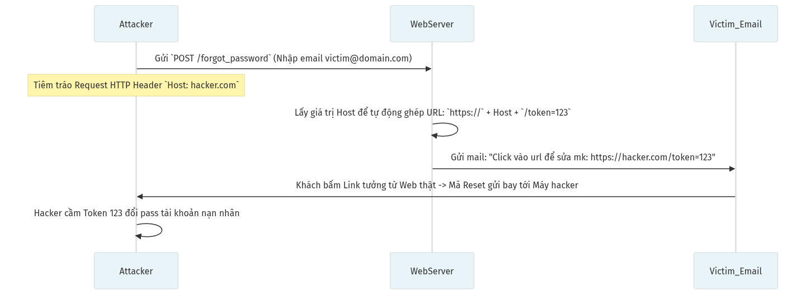

**Các bước khai thác:**
1. Chức năng Quên Mật Khẩu lười biếng tận dụng thẳng giá trị Nhãn (Host) trên Request thay vì Hardcode Tên Miền App.
2. **[Kẻ tấn công]** đánh tráo Host trên tiêu đề Request thành Tên miền giả mạo của mình (như `Host: hacker.com`) và điền Email của Nạn Nhân.
3. URL Link Reset Mật Khẩu gửi vào hộp thư Nạn nhân nối liền một dải biến rụng sang hệ thống Hacker.
4. Nạn nhân nhận Thư Xác Nhận Hợp Lệ từ Bank. Click nhầm và hiến rụng Token Reset về Máy tính Hacker. Mật Khẩu đổ máu.

### 19.1 Nguyên nhân
- Hầu hết các ứng dụng Web (Đặc biệt Laravel, PHP thuần, Django đời đầu) đều có Thói quen Tạo Tuyến đường Nội bộ (URL Building) lấy gốc biến môi trường từ `$_SERVER['HTTP_HOST']`. 
- Nếu Máy chủ Vận Hành (Nginx/Apache Proxy) cấu hình sơ hở, Nó không Lọc Chuỗi Host này mà Truyền thô (Bypass Forwarded) vào Tầng Ứng Dụng.

### 19.2 Phân loại và Khai thác
| Cấp độ Khai thác | Đặc trưng Rủi ro |
|---|---|
| **Password Reset Poisoning** | Kỹ thuật Tẩm Độc Thư Đổi Mật Khẩu (Như sơ đồ minh họa). |
| **Web Cache Poisoning (Đầu Độc Bộ Đệm)** | Hacker nhét Host giả, Máy chủ Cache (Varnish, CDN) không biết, Cài nhầm Lệnh Lưu Bộ Đệm. Hàng ngàn Khách hàng vô xem trang sẽ bị Ném sang Máy chủ của Hacker vì Cache trả mã HTTP 301 Redirect. |
| **SSRF / Truy cập Admin Ẩn** | Chỉnh mồi Header thành `Host: localhost` hoặc `Host: internal-admin.com`. Lừa Proxy Cổng vào Ném ta qua Luồng Mạng Quản trị nội mạng. |

### 19.3 Rủi ro & Bug Bounty Report thực tế
- **Mức độ:** MEDIUM tới HIGH (Tùy biến thể - Ăn được Acc Admin thì cực kỳ giá trị). 
- **Case Study / Bug Bounty:**
  - Hàng đống lỗi Header Tẩm Độc Mật khẩu được ghi nhận trên Drupal, Joomla (Giai đoạn trước 2018). Bug này kinh điển, đơn giản, báo cáo trên HackerOne ăn tiền ngay (Trị giá $500 - $1,500 tùy Target Cấu hình).

### 19.4 Cách khắc phục

**a) Hardcode BASE_URL:** Không bao giờ dùng `$_SERVER['HTTP_HOST']` hoặc `request.get_host()` để tạo URL.

| Framework | Cấu hình đúng |
|---|---|
| **Laravel** | File `.env`: `APP_URL=https://mybank.com` |
| **Django** | `settings.py`: `ALLOWED_HOSTS = ['mybank.com']` + `CSRF_TRUSTED_ORIGINS = ['https://mybank.com']` |
| **Node.js** | Biến môi trường: `BASE_URL=https://mybank.com` |

**b) Nginx Default Server Block (chặn Host lạ):**
```nginx
server {
    listen 80 default_server;
    server_name _;
    return 444;  # Đóng kết nối ngay, không trả response
}
```
Chỉ các `server_name` hợp lệ mới được xử lý.

**c) Kiểm tra Host header ở tầng ứng dụng:**
Django tự động chặn nếu Host không nằm trong `ALLOWED_HOSTS`. Các framework khác cần thêm middleware kiểm tra tương tự.

### 19.5 Cách phát hiện
| Công cụ | Manual Testing |
|---|---|
| Mắt thường, Burp Suite Repeater | Thử luồng Quên mật khẩu. Intercept lại, đổi tham số Header cực trên cùng HTTP: `Host: evil.com`. Ấn nút Forward. Rồi vô Email check xem Link hệ thống nôn ra là Tên miền ai. |

---

## 20. INSECURE DESERIALIZATION (CWE-502)

**Tóm tắt:** Giải trình tự Không an toàn. Ứng dụng nhận Lại một chuỗi Byte bị băm/Nén (VD mảng JSON/Object Python) từ Cookie, nhưng lúc "Sống lại" hệ thống không kiểm chứng tính vẹn toàn, khiến đoạn mã hóa của Hacker kích hoạt các tính năng Ẩn (RCE).
**Ví dụ đời thường:** Bạn nhận một chiếc Ô tô Lego được gỡ rời (Serialization), đi kèm cuốn hướng dẫn lắp ráp (Byte Code). Bạn ngây thơ vừa lắp vừa nghe hướng dẫn bật công tắc nguồn ẩn bên trong (Deserialization), khiến chiếc xe phát nổ (Lệnh thực thi độc hại).

### Cơ chế hoạt động (Workflow: RCE qua Cookie)

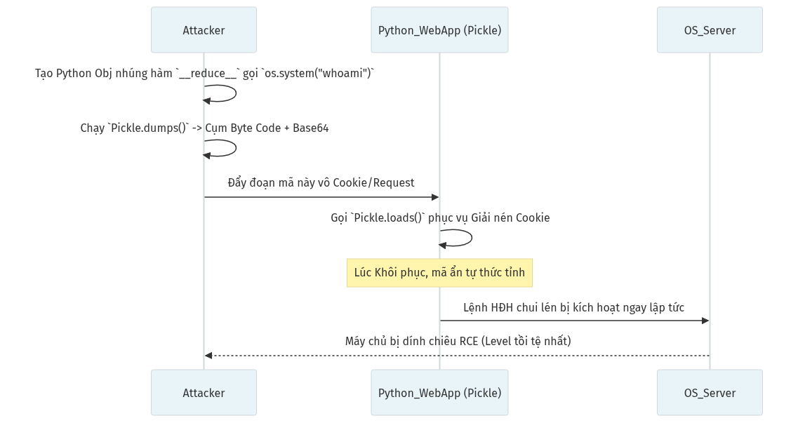

**Các bước khai thác:**
1. Nhắm trúng Ứng dụng Quản trị đang dại dột giữ Session Cookie qua Gói Serialized động (như Pickle/Java Object).
2. **[Kẻ tấn công]** dày công Nhào Nặn cục Payload (chuỗi giải nén lồng Mã Gọi API Hệ Thống RCE `bash -i`).
3. Trả Cục Nén Mã Hóa ngược vào App thay thế Cookie gốc.
4. Quá trình Ngấu nghiến dữ liệu Khôi Phục Hiện Trạng Vỡ Lở (Deserialization), tự động kích đứt Function Tiêm Chích Cấu Trúc Khối. RCE Oanh Toạc hoàn toàn cỗ máy Đích.

### 20.1 Nguyên nhân
- Sử dụng Các Ngôn ngữ có Cơ Chế "Object Life-Cycle" mạnh như Java (ObjectInputStream), Python (Pickle), PHP (Unserialize), C# (.NET Formatter) để Nén Thông Tin Người Dùng vào Chuỗi Session Cookie hoặc Request XML/JSON nhưng Kẻ thù Nắm Được.
- Giải Thuật (Deserialization) ngưng trệ không thèm có thêm Khóa Ký Chữ Ký (HMAC) ngăn chặn Tính Sửa Đổi Dữ Liệu.

### 20.2 Phân loại và Khai thác
Lỗ hổng này Siêu Cao Cấp và yêu cầu Trình Phân Tích Kịch Bản Rất Sắt Đá: Kẻ Kể Chuyện Gadget Chains.

| Kỹ thuật tạo Chuỗi Dây Chuyền (Gadget Chains)| Ứng Dụng |
|---|---|
| **Magic Methods ở PHP (POP Chain)** | Hacker tạo Class rác có Khối `__wakeup()` hay `__destruct()`. Lợi dụng Giải Trình khiến Hàm tự Xóa File hay Viết Shell. |
| **Java Commons Collections** | Lợi dụng thư viện List/Map gốc ở Java. Nó rất nổi tiếng với công cụ YSOSerial. Sinh payload Java kinh thiên động địa RCE. |
| **Python Pickle RCE** | Lợi dụng giao thức Dựng Hình Bản gốc của Python `__reduce__()` để gọi API `os.system` vô tận. |

### 20.3 Rủi ro & Bug Bounty Report thực tế
- **Mức độ:** Cực Kỳ CRITICAL (Level Boss). 100% Khả Năng Thực Thi Lệnh Xa (Remote Code Execution).
- **Hậu quả toàn diện:**
  - RCE toàn quyền trên máy chủ — Lật tung toàn bộ hạ tầng doanh nghiệp.
  - Cài backdoor vĩnh viễn, mã hóa dữ liệu đòi tiền chuộc (Ransomware).
  - Di chuyển ngang (Lateral Movement) sang các máy chủ khác trong cùng mạng.
- **Case Study / Bug Bounty:**
  - **Equifax (2017):** 147 triệu người bị lộ dữ liệu. Bản chất là OGNL Deserialization trong Apache Struts 2 (CVE-2017-5638).
  - **WebLogic Server (CVE-2020-2555, CVE-2020-14882):** Hàng loạt Zero-Day Java Deserialization cho phép RCE không cần xác thực. Oracle phải liên tục vá lỗi hàng quý.
  - **Jenkins (CVE-2016-0792):** Máy chủ CI/CD phổ biến nhất thế giới bị RCE qua Java Deserialization. Ảnh hưởng hàng triệu pipeline phát triển phần mềm.
  - **F5 BigIP (CVE-2020-5902):** RCE qua HSQLDB Deserialization, ảnh hưởng hàng nghìn thiết bị mạng doanh nghiệp toàn cầu.
  - Mức Bounty RCE Deserialization luôn ở mốc cao kỷ lục: $15,000 → $50,000+.

### 20.4 Cách khắc phục

**a) Thay Serialization bằng JSON:**
- KHÔNG dùng: `pickle.loads()` (Python), `unserialize()` (PHP), `ObjectInputStream` (Java) với dữ liệu từ user.
- DÙNG: `json.loads()` (Python), `json_decode()` (PHP), `Jackson/Gson` (Java). JSON chỉ chứa dữ liệu thuần, không thể thực thi code.

**b) Nếu bắt buộc dùng Serialization, ký HMAC:**

| Ngôn ngữ | Code ký và verify |
|---|---|
| **Python** | `import hmac, hashlib`<br>`sig = hmac.new(SECRET_KEY, data, hashlib.sha256).hexdigest()`<br>Verify: so sánh `sig` trước khi `pickle.loads()` |
| **PHP** | `$sig = hash_hmac('sha256', $data, $secret);`<br>Verify trước khi `unserialize()` |

- Hoặc dùng **JWT (JSON Web Token)** với thuật toán HS256/RS256 thay cho session cookie serialized.

**c) Java Deserialization Filter (Java 9+):**
`ObjectInputFilter filter = ObjectInputFilter.Config.createFilter("!*");` (chặn mọi class không nằm trong whitelist).

**d) Cập nhật thư viện:** Loại bỏ Apache Commons Collections phiên bản cũ (< 3.2.2) khỏi classpath Java.

### 20.5 Cách phát hiện
| Công cụ | Manual Testing |
|---|---|
| YsoSerial, PHPGGC, Burp Scanner | Trình Cấp Cao - Cần Phát hiện Bề mặt Ứng dụng Nén cái gì - (Phải là dân Penetration Tester Rành Rỏi). Nhận diện: Cookie Có `O:4:"User":2` (Thấy mùi PHP), Hoặc `H4sIA..` Base 64 GZIP Có `rO0AB` Dấu vết Java. Dùng Ysoserial Sinh Payload Rút DNS/Time delay (Sleep) Kẹp Trả. |

---

## BẢNG TỔNG KẾT 20 LỖ HỔNG

| # | Lỗ hổng | Mức độ | Biện pháp phòng chống chính | CWE |
|---|---------|--------|----------------------------|-----|
| 1 | Injection | Critical | Parameterized queries, Input validation | CWE-89 |
| 2 | Broken Authentication | Critical | MFA, Rate limiting, bcrypt hash | CWE-287 |
| 3 | Sensitive Data Exposure / Cryptographic Failures | High | HTTPS, AES-256, HSTS | CWE-311, CWE-327 |
| 4 | XXE | High | Disable DTD/External entities | CWE-611 |
| 5 | Broken Access Control | Critical | RBAC, Server-side authorization | CWE-284 |
| 6 | Security Misconfiguration | Medium–High | Hardening, Security headers | CWE-16 |
| 7 | XSS | High | Output encoding, CSP | CWE-79 |
| 8 | Known Vulnerabilities | Variable | Dependency scanning, Patching | CWE-1035 |
| 9 | Insufficient Logging | Medium | Centralized logging, SIEM | CWE-778 |
| 10 | CSRF | Medium | CSRF token, SameSite cookie | CWE-352 |
| 11 | Open Redirect | Medium | URL whitelist, Relative paths only | CWE-601 |
| 12 | SSRF | High–Critical | URL/IP validation, Network firewall | CWE-918 |
| 13 | SSTI | Critical | Template file separation, Sandbox | CWE-1336 |
| 14 | Directory Traversal | High | Path canonicalization, chroot | CWE-22 |
| 15 | File Inclusion | Critical | Whitelist includes, Disable URL include | CWE-98 |
| 16 | File Upload | Critical | MIME check, Rename, Store outside webroot | CWE-434 |
| 17 | Clickjacking | Medium | X-Frame-Options, CSP frame-ancestors | CWE-1021 |
| 18 | CORS Misconfiguration | High | Origin whitelist, No wildcard with credentials | CWE-942 |
| 19 | Host Header Attack | Medium–High | Host whitelist, Hardcode URLs | CWE-644 |
| 20 | Insecure Deserialization | Critical | JSON instead of native serialization, HMAC | CWE-502 |

---

**Nguồn tham khảo:**
- OWASP Top 10 (2021, 2025): https://owasp.org/www-project-top-ten/
- OWASP Web Security Testing Guide: https://owasp.org/www-project-web-security-testing-guide/
- CWE (Common Weakness Enumeration): https://cwe.mitre.org/
- PortSwigger Web Security Academy: https://portswigger.net/web-security
- HackerOne Hacktivity (Bug Bounty Reports): https://hackerone.com/hacktivity

---

